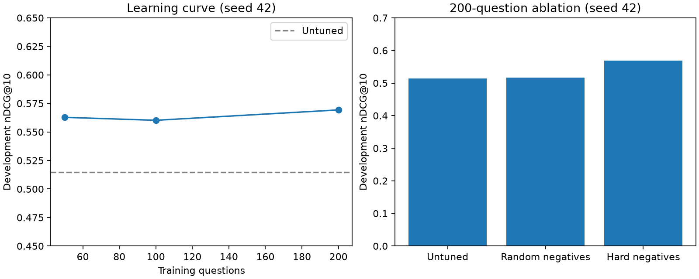

# EvidenceBench

An agent-assisted ML engineering project: reproducible research-paper evidence
retrieval, controlled reranker training, and a local containerized API.

**Measured result:** on a frozen 100-question test set (75 answerable), the trained
TinyBERT reranker achieved **0.501 nDCG@10 versus 0.378 untuned**. The paired paper-
family bootstrap 95% interval for the difference is **[0.062, 0.182]**. These are
results on a filtered QASPER sample, not official leaderboard or production results.

The benchmark contains **350 upstream human-labeled questions**, **191 papers** and
**5,908 evidence paragraphs**, split into 200 training / 50 development / 100 test
questions. Training includes nested data sizes, a random-versus-hard-negative
ablation, three seeds, immutable runs, checkpoint reload checks and local MLflow.

**Status:** retrieval/reranking and local service are verified; final held-out scoring is complete. Generated answers are experimental: the
50-question development run has **0.118 token F1, 18% coverage and 22 failures**.
The [paper-based AI review of all nine emitted test answers](docs/claim-review.md)
is complete: two correct, four incorrect and three ambiguous; two have complete
citation support. Independent human semantic review remains an unmet plan criterion.
The optional agent is deferred. See [status](docs/status.md) and
[final evaluation](reports/final-evaluation.md).

A subsequent [development-only sentence-selector experiment](reports/answer-selection-development.md)
reduced failures from 22 to zero, but token F1 fell from 0.1184 to 0.1012.
It was not promoted; the service still uses the original frozen release.

The subsequent [three-experiment short-span cycle](reports/answer-spans-development.md)
improved development F1 to **0.1533** with **zero failures**, using the same model.
Citation-ID precision declined; this remains an undeployed development candidate,
with fresh held-out and semantic evaluation still needed.

The [fresh 50-question validation comparison](reports/fresh-validation.md) has now
completed: constrained spans improved F1 from **0.0120 to 0.0754** and failures from
**21 to zero**, but failed the promotion gate. Answers to unanswerable questions
increased from **3/12 to 6/12** and citation-ID precision declined from **.364 to .321**.
The candidate is not promoted; the fresh final test remains unused and independent
human semantic review remains outstanding. The approved single attempt used 86
generation calls, 5.97 minutes on local CPU and $0 external spend.

The [subsequent offline audit](reports/fresh-selection-audit.md) shows that reranking
helps (top-three gold recall .1645 to .4934), while its top score weakly separates
answerable questions (AUC .5702). A stricter cutoff has one post-hoc gate-passing
state, retaining only eight answers; it is not adopted as a validated improvement.

A [bounded support-filter experiment](docs/support-filter-proposal.md) is now
[completed and verified](reports/support-filter-development.md): it accepted all 28
answers, including six on unanswerable questions, so it improved no quality metric
and was not promoted. It used 28 calls and 31.375 seconds on CPU, $0 external spend.
An RTX 4090 is available for future work, but the current PyTorch environment is CPU
only. Every new model training/evaluation run needs user approval; see
[compute policy](docs/compute-policy.md).



## Start the existing local deployment

Use Python 3.12, uv and Docker Desktop, from the repository root. Large artifacts
must be present; this working directory already contains them. A fresh clone needs
the local reproduction bundle or newly rebuilt/retrained artifacts; see the runbook.

```powershell
uv sync --frozen --extra ml
uv run python scripts/setup_local.py
docker compose up -d --wait db
uv run --extra ml python scripts/import_release_index.py
uv run --extra ml python scripts/export_model_cache.py
docker compose up -d --build --wait app
Invoke-RestMethod http://127.0.0.1:8000/health/ready
```

The API binds to `127.0.0.1:8000`. Readiness and version metadata are at
`/health/ready` and `/api/v1/models/current`. POST `/api/v1/retrieve` inspects evidence;
POST `/api/v1/query` returns an answer, refusal or structured failure.

```powershell
$body = @{query="In the paper 'Mining Supervisor Evaluation and Peer Feedback in Performance Appraisals', What is the average length of the sentences?"} | ConvertTo-Json
Invoke-RestMethod -Method Post -Uri http://127.0.0.1:8000/api/v1/query -ContentType application/json -Body $body
```

This development demo returned **15.5**, with source-page citations. Five repeated
warm answers measured 3.06 s p50 and 3.18 s p95 on this CPU host. Four simultaneous
requests produced one answer and three logged busy responses. These are small local
workloads, not production capacity claims. `docker compose stop` preserves data.

## Reproduce and inspect

```powershell
uv run --extra ml evidencebench evaluate --config configs/qasper-evaluation.yaml --split dev --suite rerankers
uv run --extra ml evidencebench train --config configs/training.yaml --query-count 50 --negative-method hard
uv run evidencebench recalculate --run artifacts/runs/20260919T025255Z-c1ee0ecf84
uv run pytest -q
uv run ruff check .
uv run ruff format --check .
uv run mypy src/evidencebench/schemas.py
```

Training remains bounded by the shared local budget; all nine slots have been
used. Further training requires a deliberately revised, recorded budget. Data/index outputs are
immutable; use a new output path for a rebuild. Test evaluation has a frozen protocol
and one-attempt ledger—recalculate existing predictions rather than tuning repeatedly.
The default PostgreSQL test skips without its environment variable; the
[runbook](docs/runbook.md) shows the real integration-test command.

The lockfile uses CPU PyTorch on Windows and Linux. No GPU training, paid model API,
cloud hosting, public deployment or remote CI execution is claimed. The service
container has no labels, credentials or document-upload endpoint. Original paper
PDFs stay outside Git and the redistribution bundle.

## Evidence and learning

- [Final evaluation](reports/final-evaluation.md): held-out comparisons, answers and limits.
- [Development experiments](reports/development-evaluation.md): learning curve, ablation, seeds and failures.
- [Dataset card](reports/qasper-dataset-card.md) and [model card](reports/model-card.md).
- [36 development failure cases](reports/development-failures.md).
- [Citation mismatch diagnosis](reports/citation-diagnostics-development.md) and [fresh evaluation preparation](docs/fresh-evaluation-protocol.md): offline audit and reserved families; no new held-out scores.
- [Fresh dataset](reports/fresh-dataset.md): 150 questions, 105 new paper families and 3,161 paragraphs; cache rebuild verified, validation evaluated, final test unused.
- [Fresh comparison](reports/fresh-validation.md): verified paired results and failed promotion gate; [runner](docs/fresh-validation-runner.md) documents the bounded execution.
- [Serving measurements](reports/serving-evaluation.md) and [runbook](docs/runbook.md).
- [Recorded API replay](reports/demo.html), [raw recording](reports/demo.cast), and [five-minute guide](docs/demo.md).
- [Teaching guide](docs/teaching-guide.md) and [interview preparation](docs/interview-prep.md).
- [Evidence index](docs/evidence-index.md): each prospective claim linked to artifacts.
- [Plan](plan.md): verified, incomplete and deferred criteria remain distinct.

This project is intended for learning and an honest portfolio. The user has not yet
practiced explaining every component. Existing job-market research links in the plan
refer to files absent from this checkout and were not recreated during implementation.

The selected reproduction bundle is recorded in [artifact-bundle.json](reports/artifact-bundle.json); all 201 included file hashes and a separate restore were verified. No bundle or repository content has been published. Replay HTML/JavaScript passed static checks; visual browser playback remains unverified because the browser policy blocked the local-file preview.

The completed paper review and updated handoff documents are packaged separately in
[claim-review-bundle.json](reports/claim-review-bundle.json). The supplement preserves
the original reproduction archive and includes per-file hashes for verification.

The [GPU support-checker comparison](reports/gpu-support-development.md) completed
on the RTX 4090: 24 of 28 answers were rejected, leaving four answers and F1 .0131.
The quality gate fails, so the checker is not promoted. One approved attempt used
28 calls and 38.765 seconds of worker time at $0 external spend; saved results
verify. The [runner guide](docs/gpu-support-runner.md) explains reproduction.
The preparation's 125 software tests passed, including PostgreSQL. Further model
runs require new approval; answer-quality acceptance remains incomplete.

The [saved-answer audit](reports/gpu-answer-audit.md) finds that source copying did
not establish useful answers: 19 of 22 answerable cases had better reference-overlap
spans available. Provisional agent review and a blank independent-human review
packet are provided; labels and failed acceptance gates remain unchanged.

A [fixed-input GPU generator comparison](reports/gpu-generation-development.md)
completed and passed all eight development checks: F1 .1236 versus .0754, citation-ID
precision .4583 versus .3214, and three versus six answers on unanswerable questions.
The F1-gain bootstrap interval includes zero. One attempt used 32 calls and 50.750
seconds of worker time at $0 external spend. The candidate is not deployed; human
semantic review and a separately approved fresh final evaluation remain pending.
The [24-answer review packet](reports/gpu-generation-human-review.md) is ready.

The requested [paper-grounded AI review](reports/gpu-generation-ai-review.md) is
complete: 3 adequate, 11 partial, 8 inadequate and 2 ambiguous answers under its
documented rubric. Each case includes source pages and a suggested correction.
These are assistant judgments on emitted development answers, not independent
human labels. Source copying often misses the requested information; original
scores and benchmark labels remain unchanged. The candidate remains development-only.

A [complete-answer comparison](docs/grounded-answer-proposal.md) is prepared using
the same 7B model and saved evidence, with up to 80-word answers and exact supporting
quotations. Quote presence is checked separately from semantic correctness. All
170 software tests pass, including PostgreSQL. Its [runner](docs/grounded-answer-runner.md)
requires new approval for one 32-call, 20-minute local attempt; no new model run has
occurred. [Readiness](reports/grounded-answer-readiness.json) binds the exact snapshot.
