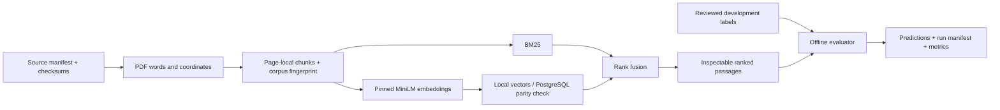

# Learning guide

## Product and main flow

EvidenceBench lets a developer search a fixed public PDF collection and trace every
result back to a source page. For example, a question about zero-trust access returns
NIST passages with stable IDs. Today it retrieves evidence; training, generated
answers and API serving remain later work.

All current Python components run locally. Docker runs PostgreSQL. JSONL/Parquet
and NumPy files hold labels, chunks and vectors; PostgreSQL stores a verified copy
of vectors for integration. The CLI currently searches the local reference index.

## Data foundation

- SHA-256 verifies downloaded bytes. A corpus fingerprint additionally covers
  extraction dependencies, window parameters, source metadata and serialized records.
  A source change and a preprocessing change are both meaningful experiment changes.
- Page-local windows make citations unambiguous, but can split an answer across
  chunks. Overlap helps continuity while creating duplicate relevant passages.
- Family splits prevent training on another revision of a held-out manual. They
  cannot prove absence of common boilerplate or pretrained-model exposure.
- Pydantic validates IDs, positive page numbers, finite geometry, label consistency,
  duplicates and split boundaries. It cannot establish factual relevance or human review.
- Chosen extractor: pdfplumber provides words/geometry under MIT licensing. An OCR
  pipeline would handle scanned pages but adds failure modes outside the initial scope.
  Multicolumn reading order, diagrams and header noise remain recorded limitations.

Read Python modules `src/evidencebench/schemas.py` and `ingestion.py` first, then
`chunking.py`. They run in the local data-building process. Inspect a returned page
in its PDF and compare the coordinates before studying individual functions.

## Retrieval and scoring

- BM25 uses word overlap, inverse document frequency and length normalization.
  It is fast and interpretable, but synonyms can be missed. The implementation uses
  positive Robertson IDF with k1=1.5, b=.75.
- MiniLM maps texts into 384-dimensional vectors. Exact cosine search is adequate
  for 1,773 chunks. Approximate indexes are an alternative when scale warrants
  their recall/speed trade-off, not a necessary portfolio keyword.
- Reciprocal-rank fusion combines ranks rather than incomparable BM25/cosine scores:
  a passage ranked first contributes `1/(60+1)` from that list. Results in both
  lists receive both contributions. Stable IDs break ties deterministically.
- Recall measures how many judged relevant chunks are found; nDCG rewards useful
  chunks appearing early, with grade 2 worth more than grade 1. A timeout counts
  as a failed empty result. Unanswerable queries have separate denominators.
- Paired family bootstrap resamples whole source families to respect dependence
  between their questions. Two dev families cannot support a strong generalization claim.

Read `retrieval.py`, then `evaluation/metrics.py` and `evaluation/runner.py`. Saved
predictions allow recalculation without rerunning models. `labels.py` rejects
unreviewed evaluation records and mines negatives only from training-family chunks.

## Tools and decisions

`pyproject.toml` declares dependency groups; `uv.lock` pins versions. The `ml` extra
contains sentence-transformers, Transformers and CPU PyTorch on this Windows setup.
`configs/retrieval.yaml` separately pins the model's immutable Hub commit and input
length. uv manages environments and locking; Ruff formats/lints; pytest checks
behavior; mypy checks shared contracts. Versions come from the lockfile/run records.

PostgreSQL/pgvector follows the plan. Exact cosine SQL is checked against NumPy
rankings. Transactions prevent a failed import from leaving half an index. Local
artifact directories reject overwrite. Neither mechanism is a hosted model registry.
MLflow integration, trained checkpoints and release manifests are still pending.

## Verification and limitations

See [evidence index](evidence-index.md). Tests use synthetic fixtures; live database
parity uses a real pinned model. Neither provides human-labeled retrieval quality.
Do not turn smoke timings into production latency or training performance claims.

The README contains runnable setup/search/test commands. A successful build emits
the corpus fingerprint; search emits source IDs/pages; test failures are not silently
ignored. Reproduction needs the pinned source/model bytes to remain downloadable.

## Later learning session

Milestone: you can now reproduce a corpus, inspect page evidence, compare retrieval
mechanisms, and audit the difference between code verification and model evaluation.
Alternative: a one-notebook demo is quicker initially but makes shared runtime paths
and immutable artifacts harder to inspect. This project keeps the package authoritative.

Optional exercise after the project is built: hand-calculate a two-list fusion
example, then explain why a shorter BM25 passage can outrank a labeled answer.
This guide records agent-assisted implementation; it does not claim you have already
practiced or independently implemented these components.
