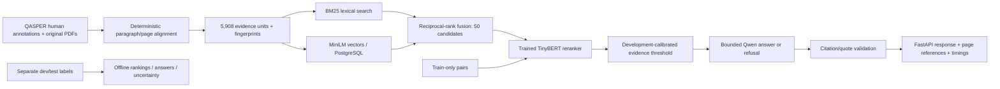

# Learning guide

This guide describes the agent-assisted implementation. It is a reading and practice
plan, not evidence that you have already mastered or independently built every part.
Start with the product and architecture, then follow the data and one request.

## Product and architecture

EvidenceBench searches a fixed collection of research papers and returns evidence
with source-page citations. Example: ask the average sentence length in the
performance-appraisal paper; the local demo answers **15.5** and links its evidence.
The strongest component is evaluated retrieval/reranking. Generated answers remain
experimental and often fail or refuse; a valid quote can still answer the wrong question.

Python data/training/evaluation processes run locally. The container runs the same
Python inference pipeline on Linux; PostgreSQL runs in a separate Compose service.
Parquet stores content units, NumPy stores reference vectors, JSONL stores labels
and predictions, and local files hold checkpoints. MLflow stores local experiment
metadata in SQLite. No cloud object store, public API, agent tools or model registry
has been added. The optional agent was deferred because answer quality is weak.

## 1. Reproducible data

You can rebuild the filtered QASPER corpus and trace evidence to original PDF pages.
Upstream humans wrote questions, answers and supporting paragraphs. The user chose
this benchmark instead of personally reviewing agent-written NIST drafts. The
original paper split becomes train/dev/test; a fixed seed and frozen ID selection
produce 200/50/100 questions across 191 papers. No final outcome selects examples.

A SHA-256 checksum identifies bytes; a corpus fingerprint covers content and its
processing recipe. Pydantic checks schema invariants, not truth. Alignment requires
numeric consistency, high character-shingle overlap and an unambiguous one/two-page
window. This drops many hard examples and creates selection bias. Formula/reference
placeholders remain; figures and tables are excluded. One dev reference still
mentions missing table content, so filtering is imperfect. These labels were never
silently repaired to improve results.

Repeated ingestion produced identical corpus and label bytes. Frozen JSONL line
endings are explicit and preserved by Git. File checksums detect accidental changes;
they do not detect semantic duplicates or unknown model pretraining exposure.

Read `schemas.py` (Python contracts), then `qasper.py` (Python alignment) under
`src/evidencebench/`. See the [dataset card](../reports/qasper-dataset-card.md).
Optional exercise: resolve a development evidence ID to its PDF page and identify
what a text alignment cannot establish about a table or diagram.

## 2. Retrieval and evaluation

BM25 scores term matches with inverse document frequency and length normalization
(k1=1.5, b=.75). MiniLM embeds text into 384 dimensions; exact cosine search is
adequate for 5,908 paragraphs. Approximate search would trade recall for speed at
larger scale. Reciprocal-rank fusion combines ranks rather than incompatible raw
scores: rank one contributes `1/(60+1)` from each list. Stable IDs break ties.

Both query and paragraph include the paper title. Retrieval searches the full
corpus; no gold paper filter is passed by evaluation. This is a title-conditioned
benchmark, not general web search. The cross-encoder jointly reads question and
passage, making it slower but often more precise than vector similarity.

Recall@5/10/20 measures recovery of annotated evidence. nDCG@10 rewards early
relevant results; this dataset has grade-2 support and unjudged zero, with no invented
grade-1 judgments. MRR uses the first support within the returned 20. Unanswerable
questions are excluded from ranking quality and retained in latency/failure/refusal
metrics. Failed answerable retrievals score zero. A family bootstrap resamples whole
papers, preserving dependence between their questions; 2,000 draws use seed 42.

Read `retrieval.py` and `evaluation/metrics.py`. Hand-calculated fixture tests cover
empty outputs, ties, duplicate IDs, failures and denominators. Saved predictions
recalculate aggregates without rerunning a model. Optional exercise: explain why
high recall@20 can coexist with low nDCG@10 and poor generated answers.

## 3. Training and model selection

You can train the reranker, compare learning curves and trace its checkpoint.
The task is binary relevance classification for question/passage pairs. 200 training
questions yield 266 human positive pairs and 800 sampled negatives. Four negatives
per question are mined only from training papers; positives are excluded. Hard
negatives are high-ranking BM25 distractors. Random negatives provide a controlled
ablation. Unjudged does not mean truly irrelevant; false negatives remain possible.

Weighted binary cross entropy compensates for the observed pair imbalance. CPU
fp32 training uses batch 16, learning rate 2e-5, three epochs, 10% warmup, and best
development nDCG checkpoint selection. The 50/100/200 subsets are nested. Seeds
42/43/44 vary training, while subset/mining seed stays fixed. No seed is selected
from final results. Larger training data produced a nearly flat learning curve;
hard negatives were more useful than random negatives in this development sample.

The selected nDCG is 0.5693 versus untuned 0.5145. Its paired 95% interval for the
difference spans zero. Three seeds all improved point estimates, but this is not
proof of generalization. Read the [experiment report](../reports/development-evaluation.md).

`training.py` is Python/PyTorch orchestration using sentence-transformers; `labels.py`
constructs pairs. Local MLflow and immutable runs record configs, source archives,
loss history, checkpoints, hashes and failures. A failed model-card setup run is
retained. Save/reload checks prove score parity within 1e-6. Optional exercise:
explain why selecting the best seed would overstate the evidence.

## 4. Answers and failure analysis

`generation.py` runs a pinned Qwen model locally. `serving/pipeline.py` retrieves,
checks the top score, packs three excerpts and resolves returned evidence IDs to
source pages. The evidence-sufficiency threshold was calibrated on development
balanced accuracy; the generator can still fail after the gate accepts evidence.

The model has 1,536 input tokens, 100 output tokens, one format retry and a
cooperative 20-second limit. Cooperative limits are checked between operations;
they are not hard process termination. Evidence enters a user-data message and no
tools are exposed. This reduces capability, but does not establish universal prompt
injection resistance. Fixtures test message roles and bounded repair.

Nonboolean answers must be exact quotes in each cited excerpt. Yes/No uses a weaker
citation-only check and an English boolean-question heuristic. A development bug
accepted No for What questions; v3 rejects it. The 50-question v3 run has 18%
coverage, token F1 0.1184 and 22 failures. Citation-ID agreement is 0.60 precision,
not a measured fraction of semantically supported claims. Human auditing of
**generated claims** remains an unmet acceptance criterion. Upstream human answer
labels do not automatically supply those new judgments.

See [36 development failure cases](../reports/development-failures.md). They include
wrong but real quotes, invented citation IDs, missing table content, truncated lists,
false refusals and arithmetic questions answered with a single number. Optional
exercise: distinguish provenance, answer correctness and semantic claim support.

## 5. Service, deployment and reproducibility

FastAPI exposes five read-only routes. PostgreSQL uses parameterized SQL and exact
cosine search; startup validates corpus/index/model artifacts, and readiness counts
actual evidence rows. A single inference lock bounds concurrency: excess requests
return logged 429 responses. Dependency errors return 503; malformed generation
returns 502; timeouts return 504; invalid input returns 422. No endpoint accepts
labels, retraining, model reload or document uploads.

Docker runs a non-root CPU image with pinned base digest, locked dependencies and
read-only artifact mounts. The serving container has no labels or HF credentials.
Rollback restarts the previous image/release. The local DB outage test returned
live=200, ready=503, query=503; rollback restored the older NIST pilot. Fifty dev
retrievals matched the exact Windows rankings in the fresh Linux service. The
49-test suite includes real PostgreSQL checks; schema mypy is intentionally narrower
than whole-project static typing. CI is configured but no remote CI run is claimed.

Read `serving/app.py` (Python HTTP boundary) and `storage.py` (Python SQL boundary),
then the YAML `compose.yaml` (container wiring) and Dockerfile (image build recipe).
Follow the [runbook](runbook.md) for commands, retained state and recovery.
Optional exercise: explain why liveness stays healthy during a database outage and
why a five-request p95 cannot describe production load.

## Tool choices and later practice

`uv.lock` is the dependency version authority. uv manages the Python environment;
Ruff formats/lints; pytest verifies behavior; mypy verifies shared contracts.
PyTorch/sentence-transformers were chosen for trainable ranking, not keyword count.
MLflow is local; exported artifacts remain usable without its UI. PostgreSQL follows
the plan and provides a real serving dependency; NumPy remains the reference.
Matplotlib is an optional report-generation tool (`uv run --with matplotlib ...`).

Learning order: product demo → architecture → one evidence ID → ranking metrics →
training data/loss → selected run → an answer failure → deployment/recovery →
interview questions. The historical [NIST pilot card](../reports/nist-pilot-card.md)
records earlier extraction checks. No study or quiz is required during implementation.

## Paper-based answer review

The completed [nine-answer audit](claim-review.md) separates paper correctness,
support from emitted citations, and agreement with existing annotations. For example,
`0.331` and `5` occur in valid sources but do not answer a method/list question.
Conversely, the LSA paper supports Yes even though stored human alternatives disagree.
This explains why token F1 and citation-ID overlap cannot measure semantic quality.

The audit used original PDF text and selected page renderings, with source hashes
checked against the frozen manifest. Its JSON records every answer, citation and
paper location. It is single-reviewer AI analysis of nine emitted answers, not a
human accuracy estimate over the full test set. Post-test findings are for explanation;
future model improvements require a new evaluation protocol and held-out data.
Optional later exercise: explain why the UIT-ViIC abstract establishes manual
annotation but does not establish crowdsourcing.

## A failed candidate can still answer an engineering question

Cycle 2 separates generation-contract reliability from answer quality. The same
small language model selects a source-sentence number through a finite token trie;
ordinary Python constructs the answer and citation. This removes the need for the
model to copy exact text and emit valid JSON. It eliminated failures on the replay,
but the model often selected the wrong sentence, and average reference F1 fell.

The original generator remains frozen. The new Python module
`src/evidencebench/generation_selection.py` runs locally for this experiment;
`evaluation/selection_runner.py` supplies only development question/context inputs.
The runner checks label membership for evaluation but never sends labels to the
model. Predeclared gates prevented deploying a candidate just because it answered
more often. See the [result](../reports/answer-selection-development.md).

A review caught incomplete sentences at clipped passage boundaries. A synthetic
regression test reproduced the issue, the run was interrupted and retained, and a
documented replacement completed after correction. Optional later exercise: explain
why a reference-matching number can be preferable to a longer, perfectly quoted
sentence that answers a different question.

## Short answers and constrained generation

Cycle 3 keeps short source spans instead of forcing whole sentences. The Python
`generation_spans.py` module builds a token trie from eligible source text: each
generated token must follow an allowed path, and a terminal node permits stopping.
This makes exact-copy output reliable without retraining the model. Ordinary code
supplies the first matching citation for quotes; Boolean citations remain model
choices. The generator never receives evaluation references.

Plain short-answer prompting failed, while constrained spans improved development
F1 from .1184 to .1533 and removed explicit failures. Removing the repeated paper
title lowered F1 to .1372 but improved observed refusal behavior. Citation precision
declined for both. The predeclared selection rule preserves an honest comparison;
it does not prove a candidate is ready for release. [Evidence](../reports/answer-spans-development.md).

The external watchdog matters because cooperative checks cannot interrupt a stalled
model call immediately. A killed attempt keeps its slot and termination record.
Optional later exercise: explain why a valid token path guarantees source membership
but neither question relevance nor correctness of a Yes/No inference.

## Diagnosing missing evidence and reserving a new test

The local Python audit now separates wrong citation IDs from unavailable gold
evidence. In 12 of the constrained candidate's 18 citation mismatches, the packed
context has no gold paragraph. A decoder restricted to that context cannot emit its
gold citation ID. This points toward measuring retrieval and packing separately;
it does not prove that the available passages contain no valid support.

`evaluation/development_audit.py` contains deterministic classification and family
selection; `scripts/prepare_fresh_evaluation.py` connects these helpers to retained
artifacts. A fixed hash order chooses new paper families without considering their
questions, answers or model performance. Excluding cached and attempted papers as
well as selected papers is conservative: previously rejected data may still have
influenced development decisions. The trade-off is a smaller, potentially biased
remaining population, which must be disclosed.

Behavior tests cover missing versus available gold evidence, duplicate quote text,
Boolean outputs, whole-word matching and split isolation. Artifact checks recover
the existing citation precision and reproduce the reservation. This prepares the
evaluation boundary; no fresh dataset has been aligned or evaluated yet. See the
[diagnostics](../reports/citation-diagnostics-development.md) and
[protocol](fresh-evaluation-protocol.md). Optional later exercise: explain why
randomly splitting the old 191 papers again would not create a fresh held-out test.

## Building a fresh evaluation corpus reproducibly

The fresh dataset is now built: 150 upstream-human-labeled questions over 105 new
paper families and 3,161 aligned paragraphs. Python's `fresh_data.py` supplies the
selection and download logic; `scripts/build_fresh_qasper.py` orchestrates it locally
using httpx, pdfplumber and Parquet. Existing annotation and alignment helpers retain
their original behavior. Two questions per family limit concentration, while fixed
answerability quotas preserve the intended mix. These choices affect the population
and should be disclosed, rather than described as random sampling.

Download budgets must survive restarts. The builder records a request before sending
it, verifies cached checksums, counts redirects as requests, and retains unavailable
paper skips. Review revealed that automatic redirects could bypass pacing and that
parser failures needed explicit recovery. Regression tests reproduced both cases.

A cache-only verification recomputed alignment/selection and compared exact records
and label bytes. It left 631 tracked build files unchanged. This proves this local
rebuild, not arbitrary future PDF availability, human page verification or model
quality. See the [dataset card](../reports/fresh-dataset.md). Optional later exercise:
explain how a dataset can have human answer labels while its PDF page mapping is
still automatic and generated-answer support still requires independent review.

## Preparing a controlled model comparison

The new local Python comparison retrieves once for each validation question and
replays identical passages to both generators. This isolates the generation change
from retrieval differences. Labels enter scoring after inference; model interfaces
receive only the question and retrieved text. The frozen control and candidate
share a loaded Qwen model/tokenizer but retain their existing generation methods.

`evaluation/fresh_runner.py` owns preflight, model wiring and the process watchdog;
`fresh_comparison.py` owns paired predictions, metrics and durable usage counters;
`fresh_verification.py` checks saved evidence without rerunning models. Counters
charge work before calls, and an interrupted attempt cannot be silently reused.
Output-token reservations are upper bounds, not claims about actual emitted tokens.

Review exposed subtle failures: offline flags set after importing a library may
be too late; weights alone do not fingerprint pooling/tokenizer configurations;
a reranker failure must not erase successful retrieval; and a worker's complete
file does not override a supervisor timeout. Regression tests cover all four.
Synthetic end-to-end tests and real artifact preflight establish readiness, while
model performance remains unmeasured. See [runner details](fresh-validation-runner.md).
Optional later exercise: explain why both generators need the same retrieved
context and why a gate should fail when citation precision is undefined.

## Learning from the completed fresh comparison

The real comparison now demonstrates why format reliability and answer quality
need separate measurements. Constrained spans eliminate 21 failures and raise F1
from .0120 to .0754, yet answer six unanswerable questions instead of three and
lower citation-ID precision. The fixed gate rejects promotion even though the most
visible metrics improve. Both systems refused six of 12 unanswerable questions;
three control failures became answers, so zero failures is not better abstention.

The saved Python/JSON evaluation traces also separate retrieval depth from packing.
Gold-evidence recall is .9737 at depth 50, .4934 in reranked top three and .3487 after
the threshold. This directs future investigation toward selection and abstention,
but is not a causal experiment proving a fix. Citation IDs alone cannot tell whether
the supporting sentence survives clipping or whether the generated claim is true.

The completed run's hashes, metrics, paired contexts, usage and supervisor exit were
verified without additional inference. A post-hoc family bootstrap supports the
observed F1 delta on this sample, while leaving the failed gate intact. Read
[the result](../reports/fresh-validation.md) and the existing Python
`evaluation/fresh_comparison.py` for the scoring flow. Optional later exercise:
explain why promotion can correctly fail when both F1 and failure rate improve.

## Relevance is different from evidence sufficiency

The new Python CLI, `scripts/audit_fresh_selection.py`, runs locally on saved JSON
traces. It compares binary gold-ID ranking quality, computes score AUC with tied
pairs receiving half credit, and replays stricter cutoffs by suppressing existing
answers. Its `--check` mode makes the diagnosis reproducible without running models.
Ten synthetic tests check metric denominators, ties, corrupted inputs and the
requirement to verify provenance before writing a report.

Reranking makes relevant passages easier to find: top-three recall rises from .1645
to .4934. Yet a question with no supported answer can retrieve highly relevant text.
The maximum reranker score has only .5702 answerability AUC on these 50 questions.
This illustrates why ranking a passage and deciding whether it answers a question
are different prediction tasks. The next investigation should preserve the useful
ranking stage while measuring evidence sufficiency explicitly.

Searching stricter cutoffs produces one apparent gate pass, but keeps only eight
answers. That cutoff was discovered using the same outcomes it was scored on, so
it is development analysis rather than evidence of generalization. A filter replay
can remove saved answers; it cannot tell us what a model would say with new context
or on previously refused queries. See [the audit](../reports/fresh-selection-audit.md).
Optional later exercise: explain why the highest-scoring unanswerable query prevents
any stricter monotone cutoff from retaining correct coverage with zero such answers.

## Preparing a direct support check

The new Python CLI `scripts/run_support_filter.py` reuses saved answers and their
cited text. Its proposed question to Qwen is whether that text supports the answer
and whether the answer addresses the question. It shares the existing tokenizer,
model loader and constrained-decoding trie; no new service or model is introduced.
The simpler alternative was a stricter relevance cutoff, whose observed trade-off
was poor. A support check adds inference cost and correlated model errors, so its
benefit must be measured rather than assumed.

Checker prompts are built from an explicit three-field payload: question, proposed
answer and cited evidence. Labels remain outside that boundary. The output can
keep an answer, refuse it, or record a failure. The experiment scores all 50 rows,
preserves original failures/refusals, and rejects a result that improves some metrics
by losing most existing F1 or coverage. Checker time is separate from replayed
historical generation time; adding those timings is not a new service benchmark.

Tests use real Torch tensor operations with fake model weights/outputs to exercise
the adapter and a complete synthetic worker. They cannot measure Qwen's judgment
quality. A hard external deadline protects the whole process; cooperative per-call
timeouts are checked again after return. Approval pins an exact snapshot, and an
interrupted attempt cannot be silently reused. See [the runner guide](support-filter-runner.md).
Optional later exercise: explain why same-model verification is neither independent
human review nor proof that the cited claim is true.

## The support checker accepted everything

The completed fixed experiment returned SUPPORTED for all 28 proposed answers,
including all six unanswerable cases. It added about .796 seconds median check time
without changing any prediction or quality metric. The pipeline and its controls
worked, but the proposed ML intervention did not. The failure belongs in the
portfolio evidence rather than being relabeled a successful verification layer.

This is one small-model, fixed-prompt result on reused development questions; it
does not isolate whether model capacity, prompt wording, constrained decoding or
correlated mistakes caused the behavior. No causal diagnosis or universal failure
of self-checking is claimed. See [the result](../reports/support-filter-development.md).

The user's RTX 4090 broadens future experiment options, but the current PyTorch build
is CPU-only. A driver/device inventory is not a model benchmark. A separate compatible
runtime, pinned dependencies and explicit approval for each new model training or
evaluation run are needed. Preserve CPU reproduction and state hardware scope when
comparing performance. Optional later exercise: explain the difference between a
well-controlled experiment and an intervention that actually improves the model.

## Preparing a bounded GPU comparison

The project can now prepare and supervise a separate GPU support checker while
retaining the verified CPU pipeline. The Python parent
`scripts/run_gpu_support_filter.py` runs in the original environment and constructs
28 cited-only payloads. The standalone Python `scripts/gpu_support_worker.py` uses
an isolated CUDA environment and returns decisions; scoring stays in the parent.
This prevents accidental inclusion of reference labels in model inputs. It is an
input boundary, not an operating-system security sandbox.

PyTorch supplies tensor execution, Transformers loads the pinned model, and
Accelerate supports device placement. A separate lockfile avoids changing the
frozen CPU runtime. BF16 avoids adding quantization to the proposed comparison;
its memory cost may still exceed available VRAM. Model files are hashed before
execution, and an exact file roster rejects an extra checkpoint that a loader
might otherwise prefer. Package imports prove neither model fit nor inference.

The CPU checker accepted every answer. The next hypothesis is that a larger
checker may distinguish supported answers better with the same prompt and input.
It could also repeat that failure. Because precision, device and library versions
change too, any difference cannot be attributed solely to parameter count.
A per-call meter reserves tokens before generation; the external parent kills a
worker exceeding the hard deadline. A consumed attempt cannot silently retry.

Verification: ten new synthetic tests, 125 total tests including PostgreSQL,
static checks and read-only artifact verification pass. Review exposed Windows
default text decoding and stale-scoring risks; explicit UTF-8 and rechecking the
frozen base address them. Real GPU execution awaits approval. Read the
[gpu runner guide](gpu-support-runner.md) for reproduction and limits. Optional
later exercise: explain why an unchanged answer-quality gate can still overfit
when the same development sample is inspected repeatedly.

## GPU result: reliable execution can still fail product acceptance

The approved [GPU comparison](../reports/gpu-support-development.md) ran without
errors but retained only four answers. Answering fewer unanswerable questions is
helpful, yet suppressing most answers also lowers coverage and token F1. The
predeclared retention guards prevent presenting near-universal refusal as success.
Question answerability labels do not prove a particular answer is supported by
the snippets actually supplied. Human semantic review remains separate.

The unchanged scripts loaded the 7B model on RTX 4090 and produced 28 valid labels.
Saved-artifact verification recomputed the complete 50-question comparison twice
without additional inference. Checker p50/p95 (.135/.207 seconds) exclude the
original answer pipeline, and hardware/model/runtime differences prevent a clean
CPU/GPU speedup claim. Keep the failed run and its consumed allowance. Optional
exercise: explain how a gate can pass abstention safety while failing usefulness,
and why filtering cannot recover evidence lost before generation.

## Diagnosing the generator before scaling the checker

The [offline audit](../reports/gpu-answer-audit.md) shows why constrained decoding
can produce valid source copies that do not answer a question. The source-span
trie permits prefixes ending at up to 15 words; many grammatical or incomplete
fragments are therefore valid outputs. Thirteen answers reach the cap. A gold-aware
best-span F1 calculation is a diagnostic ceiling only; using it to choose answers
would leak references. Nineteen of 22 answerable outputs have a better-overlap
span in the existing input, motivating a fixed-input generator comparison.
Eight new regression tests protect denominator/roster/citation checks; 133 total
tests pass. Optional exercise: explain how the wrong subset size can receive
positive token F1 despite failing the actual question.

## Isolating answer selection with saved evidence

The new Python runner `scripts/run_gpu_generation.py` prepares the same textual
choices and prompt as the frozen CPU constrained generator. Its standalone GPU
worker uses the already pinned CUDA environment and a token-prefix trie, without
importing the scoring package or receiving labels. The parent validates spans and
scores afterward. Thus model/runtime change while retrieval and input text stay
fixed; this still is not a pure parameter-count experiment.

Eleven synthetic tests verify full 50-row reconstruction, 32-call accounting,
approval/attempt binding and failure paths. Review exposed an eligible Yes span
in a nonboolean question: downstream validation must record a per-query failure
rather than abort scoring. Its regression now passes. All 144 tests pass with
PostgreSQL. See the [runner guide](gpu-generation-runner.md). The pending budget
is one attempt/32 calls/2,048 output tokens/20 minutes, no warmup or retry.
Optional exercise: explain why the 18 unchanged refusals must stay in denominators
but must not be mixed into a new GPU-generation latency percentile.

## A gate pass with uncertainty still visible

The [fixed-input GPU result](../reports/gpu-generation-development.md) passes all
eight predeclared conditions. F1 rises from .075424 to .123578 and unanswerable
answers fall from six to three. The paired bootstrap resamples paper families,
keeping related question pairs together; its interval [-.022313, .125398] includes
zero. A point-estimate gate pass and inconclusive uncertainty can both be true.
The interval is descriptive and does not correct repeated development selection.

Only 32 rows incurred generation. All 50 stay in quality metrics, while the new
GPU latency summary excludes the 18 historical refusal timings. The 24-answer
review packet checks a different question: whether the actual cited text supports
useful answers. Token overlap and citation-ID precision cannot provide that human
judgment. Real run verification recomputed predictions/metrics and preserved all
source, input, output and usage hashes. Optional exercise: explain why a gate pass
is not permission to deploy or repeatedly inspect the final test.

## Reviewing whether an answer actually answers the question

The [paper-grounded review](../reports/gpu-generation-ai-review.md) provides an
explanation and suggested correction for every emitted GPU answer. It sits after
generation and scoring as diagnostic documentation; it does not rewrite predictions.
Python reads saved JSON and hashes local files; PDF page text locates evidence and
pypdfium2 renders ambiguous tables for visual inspection. No model was loaded.

Four axes prevent misleading conclusions: responsiveness asks whether the requested
fact is supplied, completeness checks omissions, citation support checks the emitted
content with its referent, and full-paper correctness checks broader evidence.
A source-grounded F1 score still fails a question asking for model names. NCEL's
conclusion claims broad superiority, while its table includes losses and ties.

The conservative review gives 3 adequate, 11 partial, 8 inadequate and 2 ambiguous
out of 24 emitted answers. This is single-assistant, non-blinded analysis; neither
the 26 refusals nor final-test examples were reviewed. Keeping the original labels
preserves comparability when a paper contradicts a benchmark annotation. The
verification record checks roster, exact outputs/citations, page ranges and hashes;
it cannot certify the assistant's semantic judgments. Optional later exercise:
explain why case 11's copied pronoun changes the subject and invalidates support.

## Complete answers with auditable quotations

The experimental Python contract in `scripts/grounded_answer_contract.py` allows
an answer to combine evidence and attaches exact quotes. It runs in both the CPU
validator and isolated GPU worker without importing the serving package. The
worker receives only the question and evidence; scoring labels remain in the parent.
This gives the generator room to supply lists and method names while preserving
the original retrieval comparison. The production API remains unchanged.

The alternative was longer extractive spans. Allowing paraphrases can improve
responsiveness, but introduces unsupported-inference risk: a true quote does not
entail every answer attached to it. The output therefore says
`exact_quote_presence_only`, not semantically verified. Strict JSON, known IDs,
unique keys and bounded body quotes catch structural failures; paper review still
addresses meaning. Invalid output counts as failure, not a successful refusal.

Twenty-six synthetic checks and all 170 software tests pass, including PostgreSQL.
Code review found that hashing a verified run was insufficient if a report could
select another baseline path; the runner now binds both paths to the same run.
Read-only preparation verifies cached files without model execution. The proposed
32-call allowance is new and unconsumed. Optional later exercise: explain why an
80-word correct response can have lower token F1 than a short partial response.

## Interpreting the failed complete-answer run

You can now inspect a real failed GPU protocol comparison, including every invalid
output and all emitted answers. It sits between generation and offline scoring;
the local API remains the earlier frozen release. The Python verifier reconstructs
predictions from saved JSON without loading a model, while the isolated PyTorch/
Transformers worker performed the original 32 calls on RTX 4090.

The [result](../reports/grounded-answer-development.md) shows why one improving
metric is insufficient: token F1 increases from .123578 to .143765, but ten outputs
become failures and citation-ID precision falls. The 11-condition gate rejects the
candidate. Four outputs copy exact quotes that exceed the length limit, two alter
quotes, one does both, and three contain malformed JSON. Relaxing validation after
seeing failures would evaluate a different protocol and obscure the comparison.

The design allowed paraphrased answers with verbatim evidence to improve completeness.
That also made the generator responsible for JSON syntax, copying and word limits.
A possible alternative is returning IDs of predefined spans, with quotations
assembled deterministically; it would need its own proposal and verification, and
would still not prove that selected spans support a useful answer.

Launch verification and separate read-only recomputation check the actual run.
The 170 software tests passed during preparation; they prove software behavior on
fixtures, not that a language model obeys the contract. A paired family bootstrap
on 38 answerable queries gives an F1-gain interval [-.048272, .086372]; repeated
development inspection further limits generalization claims. Human semantic
acceptance and the unused final test remain separate work.

Read [the raw failures](../reports/grounded-answer-errors.md) beside the Python
[contract](../scripts/grounded_answer_contract.py), which runs locally in the
worker and verifier. Reproduce the saved checks with
`.venv/Scripts/python.exe -X utf8 scripts/run_grounded_answer.py --verify`;
`status: verified` means intact, reproducible artifacts, while
`passes_development_gate: false` records the failed quality decision. Optional later
exercise: explain why a copied but overlong quote is a protocol failure, while a
short exact quote attached to "an existing dataset" can pass syntax yet be unhelpful.

## Selecting evidence IDs instead of copying quotations

The next experiment can assemble quotations from source IDs. The Python
[contract](../scripts/span_id_answer_contract.py) runs locally in both the validator
and GPU worker. It partitions supplied passage bodies into ordered spans of at
most 40 whitespace words, preserves source offsets and gives each span an ID.
The generator returns a complete answer plus up to three IDs; code supplies the
quotes. Two selected spans in one passage count as one passage citation in the
existing evidence-ID metrics.

This removes copying and quote-length arithmetic from generation. It does not
ensure valid JSON or useful answers. All body words remain available, but selecting
only three short spans can omit context needed to support a complete answer.
The partition is deterministic punctuation/whitespace processing, not learned
segmentation. Prompt presentation changes, so the comparison cannot isolate JSON
format alone. We retain the same model, evidence, token budgets and eleven gates.

The Python [runner](../scripts/run_span_id_answer.py) and
[worker](../scripts/span_id_answer_worker.py) reuse frozen helpers through private
module instances. This avoids modifying old experiments or duplicating their
supervisor, scoring and inference code. The trade-off is that function globals
remain attached to their module instance: tests must verify the new contract is
used and that an independently loaded old runner keeps its old behavior.

Twenty-four new synthetic tests cover source coverage/offsets, malformed outputs,
unique passage scoring, label exclusion, a full 50-row lifecycle, durable budgets,
one-use execution and pre-load tamper rejection. Both code reviews found no
actionable issues. Tokenizer-only preparation verifies all 32 prompts fit the
2,048-token limit, with 484–1,142 tokens and 543 spans. No new model-quality result
exists. Optional later exercise: explain why a correctly assembled quotation may
still fail to support the generated answer, and how you would review that case.

## A successful format change can still fail the quality gate

You can now reproduce the [real span-ID result](../reports/span-id-answer-development.md)
from saved raw JSON. The local Python validator maps the model's span IDs back to
source text; all 41 quotes match. Compared with the failed complete-answer protocol,
all ten invalid responses become valid answers. With 30 answers and no failures,
token F1 reaches .214084. This is measured development behavior, separate from the
194 synthetic/integration software tests that passed during preparation.

The architecture separates structure from meaning. Deterministic quote assembly
solves exact copying and quote budgets. It cannot prevent an answer from reporting
Twitter F1 .95 while its own source says .94, nor detect that "perso" is an incomplete
answer copied from a clipped passage. The source packet makes these mistakes
inspectable. Increasing token overlap does not make those claims correct.

Nine of eleven gates pass. Four unanswerable answers exceed the allowed three and
citation-ID precision .428571 misses .458333. The paired family-bootstrap F1-gain
interval [.029309, .160313] is positive, but reuse of development data means it is
not an unbiased confirmation or permission to waive other criteria. Retain both
the improvements and failed conditions when explaining the experiment.

The run consumed 32 calls, 962 actual output tokens and 60.656 seconds on RTX 4090;
the new allowance cannot be reused. Verification reconstructs every row and metric,
checks the 18 unchanged refusals and records source/usage hashes without inference.
Use `.venv/Scripts/python.exe -X utf8 scripts/run_span_id_answer.py --verify` to
recompute saved evidence. Read the [result](../reports/span-id-answer-development.md)
beside the [review packet](../reports/span-id-answer-review-packet.md). Optional
exercise: explain why improved citation recall can coexist with lower citation
precision, and why neither alone establishes support for the full generated claim.
