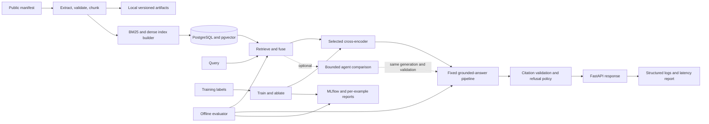

# EvidenceBench — implementation plan

**Goal:** Build a reproducible retrieval and reranking system that demonstrates data preparation, model training, evaluation, and software delivery for U.S. MLE internships.

**Architecture:** A versioned public document corpus feeds lexical and dense retrieval, a cross-encoder reranker, and a fixed grounded-answer pipeline. Offline evaluation and FastAPI serving share the same pipeline. A bounded agent is a separate extension for AI software engineering applications.

**Tech stack:** Python, PyTorch, Transformers, sentence-transformers, BM25, PostgreSQL/pgvector, FastAPI, Docker, pytest, and local MLflow. LoRA, LangGraph, visual models, and additional monitoring services are conditional.

**Research basis:** [September 18, 2026 market review](research/2026-09-18-job-market/market-review.md) and [200 source-linked postings](research/2026-09-18-job-market/job-sample-200.md).

**Status:** Implementation in progress; verified corpus/retrieval pilot. See [execution status](docs/status.md). The user selected an existing human-labeled benchmark on September 18, 2026; corpus adaptation is in progress.
**Primary target:** MLE internship, particularly applied ML, search/ranking, and NLP/LLM systems.
**Secondary target:** AI software engineering internship or graduate role.
**Schedule:** Eight focused weeks, or roughly 10–12 part-time weeks as a planning estimate. The optional extension uses remaining time within that budget.
**Portfolio claim:** An evaluated retrieval/reranking system whose data, trained model, failure analysis, and serving trade-offs can be inspected and reproduced.

For implementation, work through the phases sequentially using the executing-plans workflow. This document does not require parallel agents or automatically trigger implementation.

## 1. Why this project

The research sample contains 100 internships and 100 full-time U.S. postings observed within the previous month, including 50 explicitly flagged reposts. Python appeared in 81 internship descriptions, evaluation/experimentation in 74, serving/deployment in 55, PyTorch in 46, retrieval/RAG/ranking in 34, and agents/tool use in 32. Agents appeared in 50 full-time descriptions. LoRA/PEFT appeared in only 4 of the 200 descriptions.

These are mentions across responsibilities and required/preferred qualifications, not universal hiring requirements. The sample is a targeted convenience sample; 49 records are from TikTok/ByteDance. The review includes a sensitivity check excluding that group. Do not present these results as representative market shares or proof that this project increases hiring probability.

The résumé already demonstrates backend delivery, testing, cloud/infrastructure work, and PyTorch medical-imaging research. EvidenceBench should add clear ownership of an ML problem: constructing useful data, selecting metrics, training a component, analyzing errors, and deploying the justified configuration.

This is a search/NLP specialization. For computer-vision roles, use the existing OCT research as complementary evidence. PDF extraction alone does not demonstrate visual-model development.

## 2. Required outcomes

- A public corpus with provenance, document-family splits, stable identifiers, and reproducible processing.
- Separate training data and human-reviewed development/test evaluation sets.
- BM25, untuned dense, hybrid, and untuned cross-encoder baselines.
- One reproducible trained reranker, a training-data learning curve, and a hard-negative ablation.
- Paired evaluation of quality, failures, and latency. Positive training gains are not a completion requirement.
- Grounded answers with source-page citations and a measured refusal policy.
- A containerized API running on one documented deployment target, with version metadata, structured logs, and reliability checks.
- Dataset/model cards, an experiment report, and a short demonstration linked to raw results.

The trained model need not be the deployed model. If an untuned model wins under the predeclared development selection criteria, deploy it and explain the unsuccessful adaptation experiment honestly.

## 3. Scope and priority

### Required MLE core

- One coherent domain of public, text-native technical PDFs.
- Text extraction with page/section provenance and coordinates where available.
- Deterministic normalization, chunking, validation, and versioning.
- Training labels, hard negatives, reviewed evaluation labels, and explicit scoring rules.
- Retrieval baselines, hybrid fusion, and untuned/trained cross-encoder comparisons.
- A fixed retrieval → rerank → answer → citation-validation pipeline.
- One deployment, a lightweight comparison report or API demo, and reproducibility artifacts.

### Optional AI SWE extension

After the core is deployable and development evaluation is stable, add one bounded tool-using workflow and compare it against the fixed pipeline. Prioritize this extension for AI SWE applications. It is optional for the MLE core and must not displace model/data work or final validation.

### Deferred unless a measured failure justifies them

- OCR, figure extraction, visual embeddings, visual-language models, and specialized table parsing.
- LoRA/PEFT, generator fine-tuning, embedding-model training, and multiple vector stores.
- LangGraph, multiple agents, workflow UIs, and autonomous research behavior.
- MinIO/S3 artifact services, hosted registries, Kubernetes, distributed serving, and autoscaling.
- OpenTelemetry/Prometheus/Grafana services and a custom React application.

Default to one trainable component, one database, one generator, and one deployment target. Do not add a technology merely to mention it on the résumé.

## 4. User stories

1. Rebuild a dataset/index from a manifest and verify its fingerprint.
2. Compare baselines and candidates on development data without consulting final test results.
3. Reproduce training and inspect data, checkpoints, learning curves, and ablations.
4. Inspect a failed query, relevant evidence, rankings, answer, and failure label.
5. Query the deployed system and receive citations, status, versions, and stage latency.
6. Recalculate the final report from saved per-example results.
7. If the extension is enabled, compare the agent with the fixed pipeline under matched evidence and resource limits.

## 5. Architecture and interfaces



Evaluation and serving import the same retrieval, reranking, evidence-packing, and validation functions. Notebooks must not contain a separate production implementation.

| Contract | Required fields |
|---|---|
| ContentUnit | Document/family/version IDs, page, element ID, text, section, optional bounding box, source checksum |
| QueryExample | Query ID/text, split, query family, graded relevant element IDs, answerability, answer criteria, supporting evidence IDs, label provenance |
| RankedEvidence | Element ID, retrieval/reranker scores, rank, source document/page |
| QueryResult | Request ID, answer/status, citations, ranked evidence, version IDs, stage timings, validation status |
| RunManifest | Run ID, code revision, config hash, data/index fingerprints, model/tokenizer revisions, seed, hardware, elapsed time, artifact paths |

Implement typed interfaces: `retrieve(query, filters, k)` and `rerank(query, candidates, k)` return ordered RankedEvidence records; `answer(query, evidence)` returns a QueryResult. Scoring consumes QueryExample records and saved predictions rather than silently rerunning models.

## 6. Toolchain and resource decisions

Pin compatible package versions in `uv.lock` after verifying the actual environment. Pin model/tokenizer revisions separately. A mutable model name alone is insufficient for a published result.

| Area | Core choice | Boundary |
|---|---|---|
| Environment | Python, uv, Ruff, pytest; type checks on shared contracts | Select a supported Python version compatible with measured hardware during setup |
| Data | Pydantic, Pandas/PyArrow, Parquet/JSONL | Another validation library is optional |
| Extraction | One PDF text/geometry extractor, chosen after license/extraction checks | No required OCR or OpenCV |
| Retrieval | BM25, one sentence-transformer, reciprocal-rank fusion | One primary chunking scheme and one targeted alternative |
| Reranking | Small PyTorch/Transformers cross-encoder | Full fine-tuning if it fits; PEFT requires a documented reason |
| Storage | PostgreSQL/pgvector and local artifact directories | No second vector store or object-store service |
| Tracking | Local MLflow, immutable run manifests and result files | No remote tracking or hosted registry required |
| Generation | One small pinned local instruction model | Retrieval experiments remain independent of generator quality |
| Serving | FastAPI, Pydantic, Docker Compose | One app and database; read-only serving artifacts |
| Telemetry | Structured JSON logs and benchmark reports | Add monitoring services only to answer a concrete question |
| Demo | API documentation and generated comparison/error reports | Small Streamlit UI only if inspection otherwise suffers |
| Optional agent | Typed Python workflow | LangGraph only if state management warrants it |

At kickoff, measure CPU/GPU memory and pilot throughput. Record a compute/time budget, maximum run count, latency/memory limits, and any approved monetary budget in `configs/budget.yaml` before full training. Paid services are not assumed. Reduce model/context/batch size before adding cloud infrastructure. If local generation remains infeasible, document a capped hosted-model substitution, its exact model ID, cost, and reproducibility limits before use.

## 7. Planned file structure

Create files when their phase needs them; this map does not imply application code exists.

```text
README.md
pyproject.toml
uv.lock
Dockerfile
compose.yaml
configs/
  budget.yaml
  corpus.yaml
  retrieval.yaml
  training.yaml
  generation.yaml
  evaluation.yaml
  release.yaml
data/
  manifests/
  labels/
  README.md
src/evidencebench/
  schemas.py
  cli.py
  ingestion.py
  chunking.py
  indexing.py
  retrieval.py
  reranking.py
  training.py
  generation.py
  citations.py
  tracking.py
  evaluation/
    metrics.py
    runner.py
    reports.py
  serving/
    app.py
    pipeline.py
tests/
  unit/
  integration/
  fixtures/
  load/
reports/
  dataset-card.md
  model-card.md
  evaluation-report.md
  error-taxonomy.md
  evidence-index.md
  runbook.md
artifacts/                 # ignored generated data; immutable run directories
research/                  # existing market evidence, excluded from corpus
.github/workflows/ci.yml
```

The optional extension adds `src/evidencebench/agent.py`, `configs/agent.yaml`, and agent task fixtures. Split modules when they acquire multiple responsibilities; avoid scaffolding unnecessary subsystems.

## 8. Corpus, labels, and leakage controls

### Corpus and retrieval protocol

Choose one collection of public technical manuals or developer documentation with enough independent document families to support train/dev/test separation. Prefer text-native PDFs and a domain whose answers can be reviewed accurately.

The manifest records URL, usage/license conditions, checksum, retrieval date, document/version/family ID, page count, MIME type, and split assignment. Commit only redistributable sources; otherwise provide fetch instructions. Résumé content, job-market descriptions, private documents, and application records are not training data.

Group versions and near-duplicate documents before assigning roughly 60/20/20 percent of document families to train/dev/test. Adjust counts for a small corpus before labeling and record the assignments. Development/test retrieval searches the full frozen corpus, including distractors, but training and hard-negative mining use training-family content only. This measures retrieval over unseen families without fitting on their content or labels. If the corpus cannot support that claim, change the protocol before experimenting.

### Evaluation labels: separate from training

- Plan for **150–250 human-reviewed development/test queries combined**, approximately one-third development and two-thirds final test. This is a starting budget, not a statistical sufficiency guarantee.
- Include approximately 20–25% unanswerable or insufficient-evidence cases in each evaluation split. Report this deliberately constructed balance.
- Use a written relevance scale: 0 = irrelevant, 1 = useful context, 2 = directly supports an answer. Record answer criteria, acceptable citations, and ambiguity decisions.
- Spread questions across document families and query types; report family counts as well as query counts.
- Review labels without seeing model predictions. Blindly re-review a subset after a delay; do not claim inter-annotator agreement from a single reviewer.
- If only 80 reviewed evaluation queries are feasible, release an explicitly exploratory pilot with uncertainty. Do not describe it as equivalent to the planned full evaluation.

### Training data and learning curve

- Build a separate training-query set. Do not use the 150–250 evaluation queries as the entire train/dev/test dataset.
- Initial target: at least 200 distinct training queries with supported positives and sampled negatives. Report query count and query-document pair count separately.
- Compare nested subsets of 50, 100, and 200 training queries against the same development set. Expand only if the learning curve and budget justify it.
- Synthetic training queries are allowed with generator/prompt provenance and a reviewed sample. Record audit size, observed errors, and corrections. Evaluation labels require human review regardless of origin.
- Mine negatives using training-only BM25/dense retrieval. Remove known positives, review likely false negatives, and save sampler seed and pool version.
- If useful training data is inadequate, reduce corpus scope or invest in labeling before adding agents or visual features. An incomplete adaptation experiment does not satisfy the full MLE definition of done.

### Test isolation

- Freeze labels, query IDs, family assignments, and scoring rules before selection.
- Development data owns model, chunking, fusion, prompt, threshold, and deployment choices.
- CI uses independent fixtures/development examples, not repeated final-test metrics.
- Run final test evaluation after candidate configurations and scoring code are frozen; evaluate predeclared comparisons together.
- Inspect test failures after recording results. Subsequent tuning makes that set development evidence; obtain a fresh holdout before claiming a new unbiased test result.

## 9. Deterministic ingestion

1. Validate the manifest, MIME types, and source checksums.
2. Extract text, sections, pages, and available coordinates.
3. Normalize whitespace, Unicode, headers/footers, and hyphenation using versioned rules.
4. Create stable document/element/chunk IDs and source-page mappings.
5. Produce the primary chunking view and validation report.
6. Write Parquet records and a fingerprint covering sources, extractor/config, and output.

Check repeated-run fingerprints, missing text, empty pages, duplicate IDs, invalid coordinates, and broken citations. Inspect representative pages from each extraction pattern. Flag or exclude scanned/problematic PDFs rather than silently producing empty evidence.

Render pages on demand for inspection. Reliably extracted tables may be retained as text with provenance and stated limits. OCR, figure interpretation, and visual retrieval require a separate extension with a text-only control and task-specific labels.

## 10. Retrieval and model adaptation

### Baseline ladder

Implement BM25 → untuned dense → reciprocal-rank fusion → hybrid plus untuned cross-encoder → hybrid plus trained cross-encoder. Keep the corpus, query set, and scoring code constant. Metadata filters represent explicit user constraints; never supply hidden gold-document filters during evaluation.

Record Recall@5/10/20, nDCG@10, MRR, index size/build time, and stage latency. Use nDCG@10 as the primary answerable-query ranking metric. Report unanswerable queries separately.

### Training experiment

- Preserve the untuned cross-encoder baseline before training.
- Use full fine-tuning when the architecture/hardware permit it. Use LoRA/PEFT only with documented compatibility, memory savings, parameter count, and trade-offs. Generator tuning is outside core scope.
- Save data fingerprints, query/pair counts, negative sampling, model/tokenizer revision, seed, optimizer/schedule, checkpoint hash, and compute record.
- Run the nested training-query learning curve and a matched random-negative versus hard-negative ablation; keep other settings fixed for the ablation.
- Report loss curves, failed runs, overfitting, and development slices. Repeat shortlisted configurations with three seeds if the budget permits; otherwise disclose single-seed uncertainty.
- Select by development nDCG@10 subject to predeclared latency/memory limits and answerability/slice checks. Prefer the simpler or cheaper configuration when differences are inconclusive.

A well-diagnosed negative result is useful evidence. Do not force positive improvement or switch headline metrics after seeing results.

## 11. Grounded answers and optional agent

### Core fixed pipeline

Retrieve, rerank, pack evidence with stable IDs, generate structured output, validate citations, and answer or refuse. Calibrate evidence-sufficiency thresholds on development data only.

A valid citation ID establishes provenance, not factual support. Evaluate support against human-reviewed claim criteria. A model-assisted judge is supplementary; disclose its model, rubric, and disagreement with human review.

Reject invalid citation references. Permit at most one bounded output-format repair, then return a structured failure/refusal. Configure retrieval, context, token, and timeout limits. Treat retrieved text as data, never as instructions that may change system policy or tools.

### Optional bounded workflow

Use the same corpus, generator, citation checks, and evaluation protocol as the fixed control. Permit one query reformulation and an optional calculator. Expose only typed retrieval, evidence-opening, and restricted numeric-expression tools. Do not expose arbitrary code, shell, filesystem browsing, or unrestricted network access.

Default limits: one reformulation, four tool calls, and one format repair, plus configured wall-clock/token ceilings. Trace validated tool calls, outcomes, and concise state summaries; do not expose hidden reasoning.

Create development and held-out task scenarios before agent tuning. Compare completion, invalid calls, refusal, call counts, latency, and cost. Include a matched-budget comparison so extra compute is not mistaken for an architectural gain. Use deterministic tool fixtures for contracts and repeated real-model runs for behavioral variance.

LangGraph is optional. Include the agent in the demo only if development results justify the complexity; a negative comparison can remain a labeled experiment.

## 12. Evaluation and failure analysis

| Area | Required evidence |
|---|---|
| Retrieval | Recall@5/10/20, nDCG@10, MRR, per-query rankings/judgments |
| Answers | Correctness against written criteria; unsupported-claim rate |
| Citations | Fraction of cited claims supported; coverage of claims requiring evidence; invalid references |
| Refusal | Answerability precision/recall; answers and abstentions separated |
| Serving | Warm/cold p50/p95 latency, throughput, errors/timeouts, peak memory, hardware and workload |
| Optional agent | Completion, tool validity/selection, refusal, exhausted budgets, variance, latency/cost versus control |

Define denominators and missing-output treatment before comparisons. Include timeouts/failures in end-to-end reporting. Report response coverage alongside correctness so excessive refusals cannot inflate the apparent quality.

Use paired comparisons on identical queries. Bootstrap at document-family level when questions share sources; disclose small family counts and uncertainty. Preserve bootstrap seeds and per-example outputs. Automated judges are not ground truth.

Review at least 30 unique development queries that fail in a baseline or candidate. If fewer than 30 exist, review all and report the actual count. Categories: extraction, chunking, lexical/dense miss, fusion, reranking regression, false negatives in labels, insufficient context, unsupported claim, incorrect citation, false refusal, missing refusal, and annotation ambiguity. Add tool/calculation categories only for the extension.

## 13. Artifacts and release selection

Use immutable `artifacts/runs/<run_id>/` directories containing the run manifest, configuration, predictions, aggregates, plots, failure review, and checkpoint references. MLflow provides comparison and links; exported files keep reproduction possible without a tracking UI.

PostgreSQL stores corpus/index metadata and embeddings. Parquet/JSONL store processed data and labels. Local files store source documents, checkpoints, and reports. Large files stay outside Git with checksums and reconstruction/download instructions.

`configs/release.yaml` pins checkpoint/model, index/data fingerprints, prompts, thresholds, and image version. Selection uses development evidence. Final evaluation reports quality and checks correctness; it does not select a different winner from test scores. Critical failures block release and require a documented protocol reset before new test claims.

## 14. API and inspection

| Route | Responsibility |
|---|---|
| POST /api/v1/query | Fixed pipeline; answer/refusal, citations, versions, stage timings |
| POST /api/v1/retrieve | Ranked candidates for inspection |
| GET /api/v1/models/current | Release/model/index/data/prompt identifiers |
| GET /health/live | Process health |
| GET /health/ready | Database, index, model readiness |

Batch evaluation and release selection are CLI operations. Do not expose labels, training, reload, or arbitrary configuration changes through a public API. Use a curated corpus and bounded input; document upload is deferred.

Responses include request ID, status/reason, cited document/page/source references, available coordinates, evidence scores, versions, and timings. Generated inspection reports may show development labels. Keep test labels out of serving and pre-release demo selection.

## 15. Deployment and reliability

- Build a reproducible Compose app/database stack with versioned artifact mounts.
- Deploy one immutable image on one documented host. A local/campus host is acceptable if hardware/cost prevents public hosting; provide a recording and reproduction instructions without claiming public access.
- Log request/stage timings, errors, empty retrieval, refusals, citation validation failures, token usage when available, and versions.
- Generate benchmark reports from logs; dashboards are optional.
- Distinguish proxy signals from labeled quality. Do not claim drift detection from a static demo.
- Bound requests and handle database failure, corrupt/missing index, invalid input, model timeouts, and generation failure with explicit status codes.
- Roll back by restarting with the previous image and release manifest; hot reload and registry services are unnecessary.

Record host specifications, concurrency, query/context lengths, warm-up, cache state, duration, success/error counts, and peak memory. Execution time and monetary spending are different; do not describe guessed cloud costs as measured costs.

## 16. Verification strategy

| Layer | Meaningful checks |
|---|---|
| Unit/contracts | IDs, deduplication/splits, fusion, metric denominators, citation references, schemas |
| Data fixtures | Representative redistributable PDF extraction/page mapping; corrupt/scanned input |
| Integration | Index build/load, pgvector, checkpoint loading, shared pipeline, API contract |
| ML | Untuned/trained comparison, learning curve, negative-sampling ablation, loss behavior, affordable seed repeats |
| Reliability | Oversized input, missing dependencies, timeouts, malformed output, invalid citations |
| Reproduction | Clean fixture corpus/index build and reference report within stated tolerance |
| Optional agent | Schemas, limits, document-instruction resistance, invalid tool output, refusal, budget exhaustion |

Fixtures are independent of the final test set. Test behavior and failure modes rather than incidental implementation details. Full GPU experiments are separate from ordinary CI.

## 17. CI and release workflow

Pull requests run formatting/lint, contract/type checks, unit/data tests, a small PostgreSQL integration test, fixture-model API smoke tests, and a container build. Use mocked generation for protocol tests and a recorded real-model smoke run before release. Routine CI needs no GPU training.

Experiments take versioned configs, data/index versions, model revisions, seeds, and budgets; they produce immutable artifacts and MLflow records. A release takes the development-selected manifest, runs frozen final evaluation, builds/deploys the image, and records health/query/refusal smoke results. Exercise and document rollback.

## 18. Implementation phases

Commands below are the CLI contract to implement, not currently available commands. Each phase has owned files, concrete work, and an acceptance gate. Make incremental changes and record a reviewable checkpoint after each accepted phase.

### Phase 1 — corpus and reproducible data (week 1)

**Files:** Environment/lockfile; `configs/budget.yaml`, `configs/corpus.yaml`; `data/manifests/`; `src/evidencebench/{schemas,cli,ingestion,chunking}.py`; ingestion fixtures/tests; dataset card.

- [ ] Select/license-check the corpus, pilot hardware/extraction, and record limits.
- [ ] Define shared schemas and source/family identifiers.
- [ ] Add checks for repeatability, empty text, duplicate sources, and page mapping; confirm deliberately corrupt inputs are detected.
- [ ] Implement extraction, normalization, fingerprints, and source inspection.
- [ ] Assign families to splits and check near-duplicate/version grouping.

**Check:** Run `uv run evidencebench build --config configs/corpus.yaml` twice into clean output directories. Fingerprints/IDs match and sampled elements resolve to their source pages. Reject a corpus requiring substantial OCR rescue.

### Phase 2 — labels and baselines (week 2)

**Files:** `data/labels/`, labeling guide; retrieval/evaluation configs; indexing, retrieval, tracking, evaluation modules; metric/retrieval tests; error taxonomy.

- [ ] Write scoring rules and separate training/evaluation query pools.
- [ ] Review/freeze evaluation labels and audit cross-split duplicates.
- [ ] Verify metrics on hand-calculated cases, including ties, empty results, and unanswerable queries.
- [ ] Implement BM25, dense retrieval, fusion, and per-example recording.
- [ ] Run development baselines and begin failure review without final-test outcomes.

**Check:** `uv run evidencebench evaluate --config configs/evaluation.yaml --split dev --suite retrieval-baselines`. Recalculate aggregates from saved predictions; verify family disjointness and exact query/pair counts.

### Phase 3 — adaptation and analysis (weeks 3–4)

**Files:** Training config; training/reranking modules; training-data/checkpoint tests; model card and evaluation report.

- [ ] Establish the untuned cross-encoder baseline.
- [ ] Verify positive/negative construction and reject non-training-family candidates.
- [ ] Run an overfit/debug pilot to check gradients, tokenizer compatibility, loss, and checkpoint reload.
- [ ] Train the nested query subsets and matched negative-sampling ablation within budget.
- [ ] Compare development quality, latency, slices, and failures.
- [ ] Select using predeclared criteria and repeat seeds where affordable.

**Checks:** `uv run evidencebench train --config configs/training.yaml`; `uv run evidencebench evaluate --config configs/evaluation.yaml --split dev --suite rerankers`. Connect training data, curves, checkpoints, per-query changes, and latency. LoRA use and positive lift are not acceptance gates.

### Phase 4 — grounded answers (week 5)

**Files:** Generation config; generation/citation modules; citation/answer tests; evaluation report.

- [ ] Implement evidence packing, structured output, citations, and development-calibrated refusal.
- [ ] Test missing evidence, invalid IDs, malformed output, bounded repair, and instructions embedded in documents.
- [ ] Evaluate answer/citation support, unsupported claims, and refusal errors.
- [ ] Produce an inspection report linking rankings and answers to pages.

**Check:** `uv run evidencebench evaluate --config configs/evaluation.yaml --split dev --suite answers`. Valid IDs alone cannot count as supported claims. Use development examples for demonstrations.

### Phase 5 — service and deployment (week 6)

**Files:** Serving modules, Dockerfile, Compose, release config, CI, API/load tests, runbook.

- [ ] Implement bounded query/retrieval/health/version endpoints using the shared pipeline.
- [ ] Add startup checks, timeouts, structured logs, and dependency-failure responses.
- [ ] Deploy the development-selected configuration to one host.
- [ ] Benchmark warm/cold behavior and concurrency; exercise rollback.
- [ ] Verify documented commands in a fresh environment.

**Checks:** `uv run pytest tests/unit tests/integration`; `docker compose up --build`; recorded health, answer, refusal, invalid-input, and dependency-failure requests.

**Core gate:** Data, adaptation experiments, development reports, and service work together. If the gate fails, finish the core in week 7 and drop the agent extension.

### Phase 6 — choose one focus (week 7)

**Default MLE path:** Address the largest measured data/model weakness, complete uncertainty analysis, and reproduce the shortlisted run. Update existing modules/tests/reports; add no new subsystem.

**Optional AI SWE path:** Add `src/evidencebench/agent.py`, `configs/agent.yaml`, agent tests, `data/labels/agent-dev.jsonl`, `data/labels/agent-test.jsonl`, and `reports/agent-comparison.md`.

- [ ] Freeze task rules, budgets, and held-out scenarios before tuning.
- [ ] Implement the bounded workflow and deterministic tool/failure tests.
- [ ] Compare with the fixed pipeline on development tasks, including matched budgets and repeated real-model runs.
- [ ] Decide demo inclusion from development results.

**Check if selected:** `uv run evidencebench evaluate --config configs/evaluation.yaml --split dev --suite agent`. Neither path may tune from final-test results.

### Phase 7 — final evaluation and portfolio release (week 8)

**Files:** Release config, final cards/reports, evidence index, runbook, README, optional agent comparison.

- [ ] Freeze candidates, scoring, and release selection before final evaluation.
- [ ] Run predeclared test comparisons, record all outcomes, then review test failures without tuning on them.
- [ ] Reproduce the main comparison cleanly and verify the deployed version matches its manifest.
- [ ] Complete limitations, baseline/candidate figures, and a short demo.
- [ ] Link each prospective résumé claim to its run, data, metric definition, and limitation.

**Checks:** `uv run evidencebench evaluate --config configs/evaluation.yaml --split test --suite release`; inspect the actual emitted run with `uv run evidencebench inspect --run <recorded-run-id>`. Aggregates must be recalculable from predictions. Document how any post-test repair affects holdout validity.

## 19. Portfolio demonstration

Use a five-minute narrative:

1. Define the task; show corpus, query/pair counts, and family-level split policy.
2. Compare baseline/selected rankings on development examples, including a failure.
3. Show the learning curve, controlled ablation, final held-out quality, and serving trade-offs.
4. Ask answerable/unanswerable questions and open source citations.
5. Trace the release to its run manifest and show containerized API health/version information.

For AI SWE applications, add a short fixed-versus-agent comparison only when completed. Keep its metrics and resource costs separate. Do not call an offline benchmark a production A/B test or a caption parser a trained visual model.

The demo passes when the product works, ML reasoning is clear, results are reproducible, and limitations are visible.

## 20. Definition of done

### MLE core

- [ ] Corpus provenance, usage conditions, and family splits are documented.
- [ ] Repeated ingestion/index builds and page citations are verified.
- [ ] Training queries/pairs are separate from reviewed development/test labels.
- [ ] Baselines precede adaptation and comparisons share one protocol.
- [ ] Trained reranker, learning curve, and controlled negative-sampling ablation are reproducible.
- [ ] Development selection and untouched final-test reporting are documented.
- [ ] Quality, latency, memory, failures, and uncertainty are honestly reported.
- [ ] Development failures are reviewed under the documented count rule.
- [ ] Answers have measured support, citation, and refusal behavior.
- [ ] One containerized deployment handles tested failures and exposes health/versions.
- [ ] CI fixtures, clean-environment reproduction, and rollback checks pass.
- [ ] Cards, reports, evidence index, README, and demo are complete.
- [ ] Every résumé claim has supporting evidence.

### Optional AI SWE extension

- [ ] Tools/transitions are typed, bounded, and tested for failures/limits.
- [ ] Fixed-versus-agent comparisons cover held-out tasks, matched budgets, variance, latency, and cost.
- [ ] The demo distinguishes the extension from the independently complete MLE core.

LoRA, LangGraph, visual models, cloud object storage, and dashboards are not core completion requirements. Each needs evidence if implemented or claimed.

## 21. Risks and scope controls

| Risk | Response |
|---|---|
| Labeling overruns | Reduce breadth/optional features; label a small pilot honestly rather than borrowing test labels |
| Weak training signal | Audit positives/negatives, loss, and learning curves; add useful labels before architecture |
| Synthetic-label bias | Audit provenance/error rates; review evaluation labels independently of predictions |
| Fine-tuning underperforms | Diagnose/report it; deploy the development-selected baseline if warranted |
| Test contamination | Reclassify the set as development evidence and obtain fresh test data for later claims |
| Hardware/cost limits | Smaller models/contexts and bounded experiments; no assumed paid infrastructure |
| Agents delay core work | Enforce the week-six core gate |
| Infrastructure dominates | Require a measured need for another service, registry, dashboard, or framework |
| Vacancy/domain mismatch | Present retrieval work for search/applied-AI roles and existing OCT work for CV roles |

## 22. Implementation instructions

- Keep the MLE core primary; optional work cannot silently become mandatory.
- Establish schemas, data checks, and evaluation before model optimization.
- Use development data for selection and independent fixtures for CI.
- Record real resource budgets before long experiments.
- Keep final results executable through modules/commands; notebooks are supplementary.
- Preserve predictions, data/model revisions, and immutable manifests.
- Record consequential corpus/model/split/adaptation decisions in the relevant report.
- Maintain `reports/evidence-index.md` as the claim-to-artifact mapping.
- Treat source-document instructions as content, not authorization to change tools or behavior.
- Use public/authorized synthetic data; exclude credentials, private documents, résumé details, and application records.
- Never fabricate quality, latency, cost, data-volume, deployment, or hiring-impact claims.
