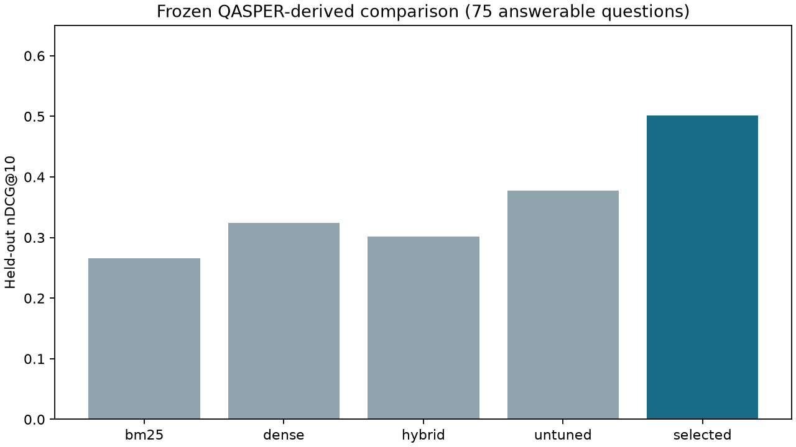

# Frozen held-out evaluation

The release, five comparison systems, code, corpus/index identifiers, model checkpoint, prompt and refusal threshold were frozen before test scoring. No test-driven tuning or reselection followed. The later training reproduction has identical pairs, parameters and dev nDCG; its checkpoint-tree metadata differs. It is a reproduction check only, and the released checkpoint is unchanged.

Ranking run: `artifacts/runs/20260919T025255Z-c1ee0ecf84`. Answer run: `artifacts/answers/20260919T025411Z-64ae20540f`. Freeze: `data/manifests/release-lock.json`; exclusive attempt ledger: `artifacts/final-attempt.json`.

## Retrieval

All 100 test questions were evaluated. Quality denominators contain 75 answerable questions from 41 paper families; 25 unanswerable questions remain in latency/failure and answer/refusal reporting. All five systems returned without retrieval failures. Retrieval searches all 5,908 paragraphs without gold paper filters.

| System | nDCG@10 | Recall@5 | Recall@10 | Recall@20 | MRR | p95 ms |
|---|---:|---:|---:|---:|---:|---:|
| bm25 | 0.2657 | 0.2956 | 0.4919 | 0.7367 | 0.2386 | 101.1 |
| dense | 0.3245 | 0.3385 | 0.5537 | 0.7463 | 0.2930 | 232.0 |
| hybrid | 0.3018 | 0.3244 | 0.5848 | 0.8000 | 0.2588 | 136.6 |
| selected | 0.5015 | 0.5633 | 0.7533 | 0.9311 | 0.4486 | 425.6 |
| untuned | 0.3777 | 0.4544 | 0.6156 | 0.8733 | 0.3538 | 450.6 |

The selected reranker improves nDCG from **0.3777 to 0.5015** (absolute +0.1238). The paired paper-family bootstrap 95% interval is **[0.0620, 0.1819]**, with 2,000 draws and seed 42. This supports a gain in this filtered sample; it does not establish universal search quality, official QASPER performance or hiring impact.

Paired answerable-query changes: {'improved': 40, 'regressed': 14, 'tied': 21}. Test results do not select a different checkpoint. Unlike the final interval, the development interval included zero; both are retained.

## Answers and refusal

| Metric | Result | Denominator / interpretation |
|---|---:|---|
| Answer coverage | 9.0% | 9 / 100 queries |
| Answer token F1 | 0.0559 | 75 answerable queries; failures/refusals score zero |
| Explicit failures | 45 | All 100 queries |
| False refusal | 38.7% | Answerable queries |
| Answerable failure rate | 52.0% | Answerable queries |
| Unanswerable refusal recall | 68.0% | 25 unanswerable queries |
| Missing refusal | 8.0% | Unanswerable queries that received an answer |
| Upstream citation-ID precision | 0.250 | Human evidence-ID agreement; not semantic support |
| Upstream citation-ID recall | 0.030 | Annotated support recovered in answered outputs |
| All-query latency p50 / p95 | 5.51 / 15.20 s | Includes failures and fast refusals |

Statuses: {'refused': 46, 'failure': 45, 'answered': 9}. Failure reasons: {'invalid_generation': 44, 'generation_timeout': 1}.

Generation does not meet a strong research-assistant quality bar. An exact quote can be irrelevant, and valid IDs do not prove semantic support. The English Boolean-question heuristic is limited. Human generated-claim support and unsupported-claim rate are **unmeasured**. Automated token overlap and human evidence-ID overlap cannot substitute for that plan criterion.

## Reproduction and limits

Both ranking and answer aggregates were recalculated from checksum-verified predictions. The selected serving rankings also reproduced exactly on all 50 development questions in a separately built Linux container using PostgreSQL instead of the Windows NumPy reference. Model/data releases remain unchanged after final scoring.

All measurements use four CPU threads. Retrieval timing includes query encoding/ranking after setup; answer timings include retrieval and generation, exclude model loading, and include failed/refused queries. Fixed system order and OS cache/scheduling can influence latency; do not interpret small differences as controlled throughput wins.

The corpus is a filtered, title-conditioned subset of public NLP papers. Selection favors text that maps to PDF pages; formulas/references remain placeholders, and missing table content remains in one development reference. Train/dev/test source families are separated, but public-model pretraining overlap is unknown. There is no human semantic review of newly generated claims, production traffic or public hosting.

Local-only experiment reports and model/data artifacts are linked in the [evidence index](../docs/evidence-index.md). No paid provider or cloud jobs were launched.

Post-test inspection of all nine emitted answers and all 14 ranking regressions is in [test failures](test-failures.md). Two emitted Boolean answers have contradictory Yes/No human alternatives; the predeclared max-reference F1 accepts either. This ambiguity is retained and further limits interpretation of answer F1. No labels or scoring were changed.
