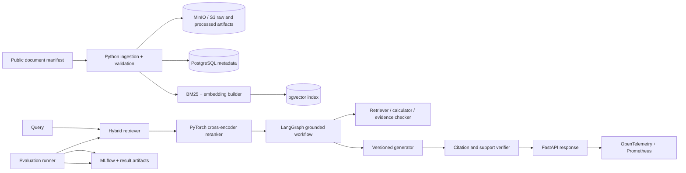

# EvidenceBench — implementation plan

Status: implementation-ready specification  
Primary role target: machine learning engineer / applied AI engineer / NLP or LLM engineer  
Expected build time: 8 focused weeks, or 10–12 part-time weeks  
Primary portfolio claim: a reproducible multimodal retrieval, reranking, grounded generation, and agent-evaluation system whose model choices are justified by controlled experiments rather than a wrapper demo

## 1. Project description

EvidenceBench is an evaluation-first document intelligence platform. It ingests a public corpus of technical PDFs containing prose, tables, figures, and diagrams; creates versioned text and image-derived representations; establishes lexical and dense retrieval baselines; fine-tunes a reranker with parameter-efficient training; builds a grounded RAG and tool-using agent workflow; and serves the selected system through an observable API.

Its defining feature is evidence discipline. Every model or prompt change is evaluated against frozen splits, reproducible configurations, ablations, latency, cost, and categorized failures. The final product lets a reviewer upload or select a technical document, ask a question, inspect retrieved text and visual evidence, compare baseline and improved rankings, view citations and refusal behavior, and open the exact MLflow run and evaluation record behind the deployed version.

The project targets the gaps recruiters repeatedly signal for MLE roles: data pipelines, scikit-learn baselines, Pandas, OpenCV, PyTorch, Hugging Face Transformers, LoRA/PEFT, RAG, vector databases, model evaluation, MLflow, FastAPI, Docker, monitoring, reproducibility, and the ability to explain trade-offs.

## 2. Goals and measurable outcomes

### Product goals

- Turn public technical documents into a searchable, citable evidence corpus.
- Answer only when the available evidence supports the answer; otherwise refuse or state uncertainty.
- Expose retrieval candidates, reranker scores, citations, tool decisions, latency, and deployed version for inspection.
- Provide batch evaluation and interactive query modes using the same versioned pipeline.
- Make the selected experiment reproducible from dataset manifest, configuration, code commit, seed, model identifier, and environment.

### ML evidence goals

- Compare BM25, untuned dense, hybrid, and reranked systems on Recall@k, nDCG@k, and MRR.
- Quantify the reranker’s quality improvement and latency cost with confidence intervals or bootstrap ranges where appropriate.
- Measure citation precision, citation recall, and unsupported-claim rate on a human-reviewed evaluation set.
- Measure agent task completion, tool-selection accuracy, refusal correctness, step count, latency, and cost.
- Maintain an error taxonomy with at least 30 manually reviewed failures before selecting the final system.
- Report serving p50/p95 latency, throughput, memory, and cost per 100 or 1,000 queries on pinned hardware.

No target number becomes a résumé claim until the corresponding run, dataset, and analysis are stored.

## 3. Scope

### In scope

- A public, redistributable or manifest-referenced corpus of technical manuals, standards-like public documents, papers, or product documentation.
- Page-level text, table, figure, caption, and coordinate extraction.
- Deterministic data validation, normalization, chunking, and versioning.
- A labeled query/relevance/answer/citation dataset with train/dev/test separation.
- BM25 or equivalent lexical baseline.
- Untuned dense embedding baseline.
- Hybrid retrieval and metadata filtering.
- Cross-encoder reranking using PyTorch and Hugging Face Transformers.
- LoRA/PEFT fine-tuning for the reranker or a compact answer model.
- Controlled ablations across retrieval, chunking, reranking, and prompting choices.
- RAG answer generation with citation linking and evidence validation.
- LangGraph agent with a bounded set of deterministic tools.
- Refusal logic for unsupported questions.
- PostgreSQL + pgvector for the main implementation; an optional FAISS offline comparison is allowed.
- MLflow tracking and model/version promotion.
- FastAPI serving, batch evaluation endpoints, containerization, metrics, and structured traces.
- A lightweight reviewer UI or an excellent interactive API page; a small React/Streamlit UI is acceptable but must not dominate the project.

### Explicit non-goals for v1

- Training a foundation model from scratch.
- Claiming state-of-the-art performance.
- Unbounded web browsing or arbitrary code execution by the agent.
- A general autonomous research agent.
- Proprietary, private, or résumé-derived training data.
- OCR for every possible language and scan quality.
- A high-scale GPU orchestration platform; that belongs to InferScale.
- Human-subject evaluation or collection of sensitive user data.

## 4. Primary user stories

1. As an ML engineer, I can rebuild a corpus from a manifest and receive the same processed dataset fingerprint.
2. As a researcher, I can run all baselines and compare them on a frozen evaluation set.
3. As a model developer, I can fine-tune a reranker, inspect training curves, and reproduce the selected checkpoint.
4. As an evaluator, I can open a failed query and see ground truth, retrieved items, scores, answer, citations, tool trace, and failure label.
5. As an API user, I can ask a question and receive an answer, cited evidence regions, confidence/refusal status, version IDs, and latency breakdown.
6. As a reviewer, I can compare baseline and selected model behavior in one demo and verify the underlying MLflow artifacts.

## 5. Architecture



### System modes

- `build`: fetch/validate documents, extract content, create frozen dataset versions, and build indexes.
- `train`: fine-tune the selected component from a versioned config.
- `evaluate`: run baselines or candidates on a frozen split and write per-example plus aggregate results.
- `serve`: load a promoted configuration and expose query/batch/health/model endpoints.
- `inspect`: render an error case with source page regions, ranking changes, answer, citations, and trace.

The same library code must be shared between offline evaluation and online serving to prevent training/serving skew.

## 6. Toolchain and pinned decisions

Pin current compatible patch versions and commit `uv.lock`. Record model revisions and dataset fingerprints, not only mutable model names.

| Area | Decision | Reason |
| --- | --- | --- |
| Language/environment | Python 3.12, `uv`, Ruff, mypy, pre-commit | Fast reproducible environment and explicit quality gates |
| Data work | Pandas, PyArrow, Pydantic, Pandera or equivalent schema validation | Typed records, columnar artifacts, deterministic transformations |
| PDF/multimodal extraction | PyMuPDF or pypdf for text/geometry, OpenCV for figures/layout preprocessing, Pillow | Visible use of image and document processing without hiding all work behind one API |
| Baselines | rank-bm25 or Elasticsearch-compatible BM25 logic, scikit-learn for feature/calibration experiments | Honest classical baseline and evaluation discipline |
| Neural models | PyTorch, Hugging Face Transformers, sentence-transformers | Recruiter-relevant training, embedding, and reranking stack |
| Efficient adaptation | PEFT/LoRA | Controlled fine-tuning on bounded compute |
| Vector storage | PostgreSQL + pgvector; optional FAISS offline benchmark | Production-like metadata/filtering with a simple local comparison |
| Agent workflow | LangGraph with explicitly typed state and bounded tools | Inspectable control flow and testable tool decisions |
| Experiment tracking | MLflow with local artifact store; S3-compatible artifact store for cloud demo | Reproducibility, comparison, and version promotion |
| Serving | FastAPI, Pydantic schemas, Uvicorn/Gunicorn-compatible runtime | Typed production API and load-testable deployment |
| Storage | PostgreSQL plus MinIO locally/S3 in cloud | Structured metadata plus versioned artifacts |
| Containers | Docker Compose | Reproducible local stack |
| Observability | OpenTelemetry, Prometheus, Grafana, structured JSON logs | Per-stage latency, failures, and traceable online behavior |
| CI | GitHub Actions, pytest, coverage, dependency/container scanning | Repeatable gates and artifact publication |
| Load testing | Locust | Python-friendly workload generation and latency/throughput reporting |

Use a small open-weight generator that fits available hardware, preferably in the 1B–3B class. Select and pin it during kickoff based on license, context length, hardware, and tool-call/citation needs. The project’s value must remain visible even if the generator is replaced.

## 7. Repository layout

```text
evidencebench/
├─ README.md
├─ LICENSE
├─ pyproject.toml
├─ uv.lock
├─ compose.yaml
├─ configs/
│  ├─ data/
│  ├─ retrieval/
│  ├─ training/
│  ├─ generation/
│  └─ evaluation/
├─ data/
│  ├─ manifests/
│  ├─ labels/
│  └─ README.md
├─ src/evidencebench/
│  ├─ ingestion/
│  ├─ schemas/
│  ├─ chunking/
│  ├─ indexing/
│  ├─ retrieval/
│  ├─ reranking/
│  ├─ generation/
│  ├─ agents/
│  ├─ evaluation/
│  ├─ serving/
│  └─ observability/
├─ tests/
│  ├─ unit/
│  ├─ integration/
│  ├─ golden/
│  ├─ contracts/
│  └─ load/
├─ notebooks/
│  └─ exploration-only/
├─ scripts/
│  ├─ build_dataset.*
│  ├─ run_baselines.*
│  ├─ train_reranker.*
│  ├─ evaluate.*
│  └─ collect_demo_evidence.*
├─ reports/
│  ├─ model-card.md
│  ├─ dataset-card.md
│  ├─ evaluation-report.md
│  └─ error-taxonomy.md
└─ .github/workflows/
```

Notebooks are for exploration only. Production transformations, training, evaluation, and figures must be executable through versioned modules or commands.

## 8. Dataset and labeling design

### Corpus selection

Choose one coherent technical domain so questions require both retrieval and understanding. Good options include public developer manuals, hardware documentation, public scientific-instrument manuals, or a bounded set of open technical papers. Prefer documents with diagrams, tables, and cross-page references.

Create a manifest with:

- stable source URL or repository reference
- license/usage note
- source checksum
- retrieval date
- document ID and version
- page count and MIME type
- split eligibility

Do not commit copyrighted binaries unless redistribution is permitted. Otherwise commit the manifest and deterministic fetch instructions.

### Processed record schema

Each content unit should include:

- `document_id`, `document_version`, `page_number`
- `element_id`, `element_type` (`text`, `table`, `figure`, `caption`)
- text or normalized representation
- page bounding box and optional image crop reference
- section hierarchy
- extraction method/version
- checksum
- provenance link to the raw source

Persist processed records as Parquet and register the dataset fingerprint in PostgreSQL/MLflow.

### Query and relevance labels

Each evaluation example should contain:

- stable `query_id`
- query text and type
- relevant element IDs with graded relevance where possible
- gold answer or answer criteria
- required citation regions
- answerability label
- permitted/expected tool path for agent tests
- split and annotator/reviewer metadata

Aim for a minimum viable set of 150–250 queries, including at least 20–25% unanswerable or insufficient-evidence cases. If labeling time is constrained, start with 80 high-quality queries and clearly report statistical limitations.

### Leakage controls

- Split by document family or version when near-duplicate passages would leak across splits.
- Freeze test labels before tuning.
- Do not use test queries to choose chunking, prompts, or thresholds.
- Run near-duplicate detection across content and questions.
- Record any synthetic-label generation and require human review for the test set.

## 9. Ingestion and multimodal processing

The pipeline must be deterministic and restartable:

1. Validate manifest and checksums.
2. Fetch or locate source documents.
3. Extract page text and geometry.
4. Render pages at a fixed DPI.
5. Use OpenCV for targeted preprocessing such as figure-region cleanup, line/box detection, or diagram crop normalization.
6. Associate captions and section context with figures/tables.
7. Normalize Unicode, whitespace, page headers/footers, and hyphenation.
8. Produce multiple chunking views with stable IDs.
9. Validate counts, missing values, coordinates, and referential integrity.
10. Write versioned Parquet and image artifacts plus a dataset card.

Required quality checks include extraction determinism, no missing provenance, bounding boxes within page bounds, stable IDs across unchanged reruns, and a manually inspected sample report.

## 10. Retrieval, reranking, and generation

### Retrieval baselines

Implement in this order:

1. BM25 over normalized text.
2. Untuned dense retrieval using a pinned sentence-transformer.
3. Hybrid reciprocal-rank fusion or a documented weighted fusion.
4. Hybrid plus metadata filters.
5. Cross-encoder reranking over top-N candidates.

For each system record configuration, index fingerprint, query latency by stage, Recall@5/10/20, nDCG@10, MRR, and per-query results.

### Reranker training

- Build positive and hard-negative pairs only from the training split.
- Establish an untuned cross-encoder baseline before fine-tuning.
- Fine-tune with LoRA/PEFT under a fixed compute budget.
- Save config, seed, model revision, tokenizer revision, data fingerprint, optimizer schedule, and checkpoint hash.
- Compare at least: untuned, LoRA-trained, and one ablation such as no hard negatives or reduced context.
- Report both retrieval improvement and added latency.
- Examine slice behavior by query type, document family, evidence type, and answerability.

### Grounded generation

- Provide the generator only the selected evidence with stable citation IDs.
- Require structured output containing answer, citation IDs, and refusal/status.
- Validate cited IDs and map them back to source page regions.
- Run an evidence-support checker that verifies answer spans or claims against cited evidence using deterministic rules plus a separately reported model-assisted score if desired.
- Keep prompt and model versions in every output.

## 11. Agent design

Use LangGraph with a typed state object. The agent may use only bounded tools:

- `retrieve(query, filters, k)`
- `rerank(query, candidate_ids, k)`
- `open_evidence(element_id)`
- `calculator(expression)` with a safe parser, not arbitrary Python
- `citation_check(answer, citation_ids)`

Suggested graph:

```text
classify question
  -> retrieve
  -> inspect evidence sufficiency
  -> optionally reformulate once
  -> rerank
  -> optionally calculate
  -> generate structured answer
  -> citation/support check
  -> answer OR refuse
```

Bound iterations, tokens, and tool calls. Store an inspectable trace of state transitions. Test expected tool choices and refusals with deterministic scenarios. Never expose arbitrary filesystem, shell, or network tools.

## 12. Evaluation design

### Retrieval metrics

- Recall@5, Recall@10, Recall@20
- nDCG@10
- MRR
- latency per retrieval and reranking stage
- index size and build time

### Answer and grounding metrics

- answer correctness scored against explicit criteria
- citation precision
- citation recall
- unsupported-claim rate
- answerability/refusal precision and recall
- evidence coverage by text/table/figure slice

### Agent metrics

- task completion
- tool-selection accuracy
- invalid tool-call rate
- refusal correctness
- average steps and tool calls
- end-to-end latency and token/cost estimates

### Statistical practice

- Store per-example outcomes, not only aggregates.
- Use paired comparisons because systems run on the same queries.
- Report confidence intervals or bootstrap ranges for material changes.
- Avoid claiming significance if the evaluation set is too small.
- Freeze and version the scoring code.
- Review a minimum of 30 failure cases and assign one primary plus optional secondary failure category.

### Error taxonomy

At minimum: extraction failure, chunk boundary, missing metadata, lexical miss, embedding miss, poor fusion, reranker regression, insufficient context, unsupported generation, incorrect citation, calculation error, wrong tool, excessive steps, should-refuse, false refusal, and evaluation ambiguity.

## 13. Storage and model registry

PostgreSQL stores documents, elements, dataset versions, index versions, experiment references, model deployments, queries, and response metadata. pgvector stores embeddings with explicit model/version dimensions. MinIO/S3 stores raw documents, page crops, processed Parquet, checkpoints, reports, and evaluation artifacts.

MLflow is the experiment system of record for:

- run configuration
- code commit
- data/index fingerprints
- model/tokenizer revision
- parameters and seeds
- aggregate metrics
- per-example result artifact
- plots and failure tables
- promoted-model alias or stage

Promotion occurs only if required evaluation gates pass and no critical slice regression is unexplained.

## 14. API surface

| Method and route | Responsibility |
| --- | --- |
| `POST /api/v1/query` | Run the deployed retrieval/agent pipeline; return answer, citations, stages, versions, and latency |
| `POST /api/v1/retrieve` | Debug retrieval/reranking with scored candidates |
| `POST /api/v1/evaluations` | Start a versioned batch evaluation for an allowed config/split |
| `GET /api/v1/evaluations/{id}` | Status, metrics, artifact links, and failure summary |
| `GET /api/v1/examples/{queryId}` | Ground truth plus selected run comparisons for inspection |
| `GET /api/v1/models/current` | Deployed model, index, prompt, and dataset versions |
| `POST /api/v1/admin/reload` | Controlled reload of a promoted version in the demo environment |
| `GET /health/live` and `/health/ready` | Process and dependency readiness |

The query response must include a trace/request ID, answerability decision, cited evidence objects with page/coordinates, retrieval/reranker scores, model/index/prompt versions, and stage latency. Hide chain-of-thought; expose concise tool and state summaries only.

## 15. Serving, observability, and monitoring

### Online telemetry

- request count, errors, p50/p95 latency
- extraction/index lookup, retrieval, reranking, generation, and verification latency
- candidate counts and empty-retrieval rate
- answer/refusal rate
- invalid citation and support-check failure rate
- tokens and estimated cost
- model/index/prompt versions
- queue depth and memory

### Quality monitoring

Because production labels are delayed, log privacy-safe proxy signals such as empty retrieval, low reranker margin, unsupported citation, refusal, and user feedback if a synthetic demo UI supports it. The report must distinguish proxy metrics from ground-truth evaluation.

### Trace design

One trace spans query validation, retrieval, fusion, reranking, each bounded agent node, generation, citation validation, and response serialization. Store stable example IDs and version IDs, not raw sensitive documents.

## 16. Testing strategy

| Layer | Required tests |
| --- | --- |
| Unit | normalizers, chunk IDs, fusion math, metrics, thresholds, tool schemas, citation mapping |
| Data contracts | manifest, processed record, label, experiment result, and API schemas |
| Golden | fixed PDF pages, extracted regions, chunk output, citation rendering, structured generation parsing |
| Integration | PostgreSQL/pgvector, MinIO, MLflow, model loading, index build, and API query |
| ML regression | frozen small evaluation set with tolerated metric ranges and deterministic seeds where possible |
| Agent scenarios | expected tool path, maximum steps, refusal behavior, invalid tool output, timeout |
| Security | path/URL restrictions, prompt injection in documents, invalid citation IDs, oversized inputs, safe calculator |
| Load | concurrency sweeps, warm/cold behavior, memory, timeouts, graceful degradation |
| Reproducibility | clean environment rebuilds a small dataset/index and reproduces a reference report within tolerance |

CI should use a tiny fixture model/dataset for speed. Full GPU training and evaluation run manually or on a scheduled/approved workflow and publish immutable artifacts.

## 17. CI/CD and release design

### Pull request pipeline

1. Ruff formatting/lint, mypy, and unit tests.
2. Data/schema contract tests.
3. Golden extraction and citation tests.
4. Small integration stack with PostgreSQL/pgvector, MinIO, and MLflow.
5. Tiny-model API smoke test.
6. Frozen mini-evaluation regression check.
7. Container build plus dependency/secret/container scans.
8. Documentation and config validation.

### Experiment workflow

- Inputs: approved config, data version, model revision, compute profile.
- Outputs: MLflow run, checkpoint, per-example predictions, aggregate metrics, plots, hardware/time/cost record.
- Never overwrite an existing run or model artifact.

### Release workflow

- Promote a verified run/config.
- Build an immutable serving image with version metadata.
- Deploy to the demo environment.
- Run query, refusal, citation, and health smoke tests.
- Store the serving benchmark and release manifest.
- Roll back by selecting the previous promoted version/image.

## 18. Implementation phases

### Phase 0 — problem framing and evaluation contract (3–4 days)

Tasks:

- Select a coherent public corpus and document licensing/provenance.
- Define query types, answerability rules, relevance labels, citation units, and metrics.
- Write the dataset card outline, leakage policy, error taxonomy, and benchmark methodology.
- Create repository, environment, schemas, config system, and CI skeleton.

Deliverables: corpus manifest, labeling guide, metric definitions, architecture, data schemas, risk register.  
Exit criterion: a new contributor can label one example consistently and explain exactly how every headline metric is computed.

### Phase 1 — deterministic ingestion and dataset versioning (week 1)

Tasks:

- Implement manifest validation, fetching, checksums, PDF text/geometry extraction, page rendering, and OpenCV preprocessing.
- Implement content schema, section/caption association, stable IDs, validation, and Parquet output.
- Build a visual inspection report comparing source pages with extracted elements.
- Create train/dev/test manifests and leakage checks.

Deliverables: versioned dataset, data-quality report, extraction golden fixtures, dataset card draft.  
Exit criterion: two clean runs create the same fingerprint and all sampled elements trace to the correct page region.

### Phase 2 — labels and honest baselines (week 2)

Tasks:

- Produce the initial labeled query set with answerable and unanswerable cases.
- Implement evaluation metrics and per-example result format.
- Implement BM25 and untuned dense baselines.
- Run error review and create at least 30 labeled failure cases.
- Add MLflow logging for datasets, configs, results, and plots.

Deliverables: frozen dev/test split, baseline runs, error taxonomy report, MLflow comparison view.  
Exit criterion: a clean command recreates both baseline reports and every aggregate is derivable from stored per-example output.

### Phase 3 — hybrid retrieval and reranking (week 3)

Tasks:

- Implement fusion, metadata filtering, and top-N candidate inspection.
- Establish untuned cross-encoder behavior.
- Build training examples and hard negatives from training data only.
- Fine-tune with LoRA/PEFT and record compute use.
- Run ablations and slice analysis; quantify added latency.

Deliverables: checkpoints, training curves, ablation table, paired metric comparison, documented selection.  
Exit criterion: the selected reranker is justified against baselines by reproducible quality and latency evidence; regressions are explained.

### Phase 4 — grounded generation and citations (week 4)

Tasks:

- Define structured generation output and versioned prompts.
- Implement evidence packing, citation mapping, answerability threshold, refusal, and support verification.
- Add answer/citation metrics and a human-review interface or report.
- Add prompt-injection and malformed-output tests.

Deliverables: grounded RAG pipeline, evaluation results, citation viewer, security tests.  
Exit criterion: answerable and unanswerable test examples produce valid citations/refusals and unsupported claims are measured, not asserted away.

### Phase 5 — bounded agent workflow (week 5)

Tasks:

- Implement typed LangGraph state and bounded tools.
- Add deterministic scenarios for direct retrieval, reformulation, calculation, citation repair, and refusal.
- Record tool decisions and state summaries.
- Measure task completion, tool accuracy, invalid calls, steps, latency, and cost.

Deliverables: agent graph, scenario suite, trace viewer, agent evaluation report.  
Exit criterion: every scenario ends within limits, unsafe tools are unavailable, and tool/refusal behavior is objectively scored.

### Phase 6 — production API and tracking (week 6)

Tasks:

- Implement FastAPI schemas/endpoints, model/index loading, batching where appropriate, timeout/error handling, health, and version endpoint.
- Connect PostgreSQL, pgvector, MinIO/S3, and MLflow.
- Add OTel traces, Prometheus metrics, structured logs, dashboards, and alerts.
- Containerize the complete local stack.

Deliverables: versioned API, Compose environment, dashboards, API contract tests.  
Exit criterion: a clean checkout serves the promoted configuration and each response exposes citations, safe trace summary, version IDs, and latency breakdown.

### Phase 7 — benchmarks, reliability, and release (week 7)

Tasks:

- Run Locust concurrency sweeps and warm/cold tests on pinned hardware.
- Test dependency unavailability, model reload, corrupted index, timeouts, and malformed input.
- Complete model card, dataset card, evaluation report, operational runbook, and limitation section.
- Add immutable release and rollback process.

Deliverables: raw benchmark outputs, reliability report, release image, model/dataset cards.  
Exit criterion: the system fails safely, the selected configuration is reproducible, and operational claims link to raw evidence.

### Phase 8 — portfolio demo and résumé evidence (week 8)

Tasks:

- Create a deterministic demo document/query set.
- Build a compact comparison screen or report showing BM25, dense, hybrid, and reranked outcomes.
- Record a five-to-seven-minute demo.
- Publish architecture, experiment lineage, evaluation figures, failure examples, and known limitations.
- Replace résumé placeholders only with measured results.

Deliverables: public-safe release, demo, evidence index, final report, truthful bullet candidates.  
Exit criterion: a recruiter sees both the product and the experimental reasoning in under five minutes; an ML engineer can reproduce the key comparison from a clean environment.

## 19. Final outcome demo

### Demo setup

- Use a frozen public document set containing prose, a table, and a diagram.
- Select one answerable question requiring evidence from multiple elements and one unanswerable question.
- Open the product/API UI, source-page viewer, MLflow comparison, evaluation dashboard, and release metadata.

### Five-to-seven-minute demo script

1. Show the dataset manifest, fingerprint, split counts, and a source page with extracted text/figure regions.
2. Ask the answerable question using BM25 only. Show retrieved candidates, ranks, latency, and any miss.
3. Run the same question with hybrid retrieval and the fine-tuned reranker. Show changed ordering and the exact evaluation delta.
4. Generate the answer. Open each citation at its source page and bounding box.
5. Show the LangGraph state summary: retrieval, optional reformulation/tool choice, generation, citation check, and completion.
6. Ask the unanswerable question. Show the refusal decision and the evaluation label.
7. Open the evaluation dashboard for Recall@10, nDCG@10, MRR, citation precision/recall, unsupported-claim rate, agent tool accuracy, p95 latency, and cost.
8. Open MLflow and trace the deployed model/index/prompt back to its data fingerprint, config, commit, checkpoint, and per-example artifact.
9. Open one failure case and explain its taxonomy plus a rejected or accepted remediation.
10. Show the containerized API, health/version response, an OTel trace, and the pinned serving benchmark.

### Expected visible outputs

- A versioned corpus and visual extraction report.
- Side-by-side retrieval rankings for at least four system variants.
- A cited grounded answer with page-region evidence.
- A correct refusal on insufficient evidence.
- An inspectable bounded agent trace.
- MLflow lineage from dataset and config to deployed version.
- Evaluation and latency/cost dashboards backed by per-example/raw outputs.
- A model card, dataset card, error taxonomy, and limitations section.

### Demo pass/fail gate

The demo passes only if the same frozen query can be reproduced, citations open to the claimed evidence, the unanswerable case is handled according to the defined policy, and every displayed aggregate can be recalculated from stored per-example output. Model quality may be modest; unreproducible or unsupported claims are not acceptable.

## 20. Definition of done

- [ ] Corpus sources and licensing/provenance are documented.
- [ ] Ingestion is deterministic and produces stable fingerprints.
- [ ] Train/dev/test leakage controls are implemented and tested.
- [ ] Labels include relevance, answerability, and citations with a written guide.
- [ ] BM25 and untuned dense baselines exist before tuning.
- [ ] Hybrid retrieval and reranking results include quality and latency.
- [ ] LoRA/PEFT training is fully reproducible from config and run metadata.
- [ ] Grounded generation has valid citation mapping and refusal behavior.
- [ ] LangGraph tools are bounded, typed, and scenario-tested.
- [ ] MLflow stores lineage, metrics, checkpoints, predictions, and reports.
- [ ] FastAPI serving shares pipeline code with evaluation and exposes version metadata.
- [ ] Traces, metrics, dashboards, error handling, and load results exist.
- [ ] At least 30 failures are reviewed and categorized.
- [ ] Model card, dataset card, evaluation report, README, and demo are complete.
- [ ] Every résumé claim is supported by a pinned run or functional artifact.

## 21. Risks and controls

| Risk | Control |
| --- | --- |
| Labeling consumes the schedule | Start with a high-quality smaller set, prioritize frozen test quality, and report uncertainty honestly |
| Synthetic labels bias evaluation | Require human review for test labels and report the origin of every example |
| Copyright or license problems | Store only permitted artifacts; otherwise use source manifests and deterministic fetch instructions |
| Project becomes an LLM wrapper | Make baselines, data quality, reranker training, ablations, per-example evaluation, and failure analysis mandatory |
| Generator hardware is insufficient | Use a small pinned open model; keep retrieval/reranking evaluation independent of generator size |
| Metric improves through leakage | Split by document family/version, freeze test data, and run near-duplicate checks |
| Agent behavior is nondeterministic | Bound state/tools/iterations; evaluate deterministic scenarios and report variance |
| Prompt injection compromises tools | No arbitrary tools; sanitize tool inputs, isolate document content, validate structured outputs |

## 22. Instructions for the implementing coding agent

- Implement the evaluation contract before tuning models.
- Do not choose a model, prompt, or threshold using the frozen test split.
- Use scripts/modules for all final results; notebooks cannot be the only reproduction path.
- Persist per-example output and environment metadata for every reported aggregate.
- Add an ADR for corpus, embedding, reranker, generator, chunking, fusion, and agent-graph choices.
- Keep an `evidence-index.md` mapping every portfolio claim to code, test, run, figure, and limitation.
- Never fabricate quality, latency, cost, or data-volume numbers.
- Use public/synthetic data only and keep credentials, private documents, personal details, and application data out of the repository.

